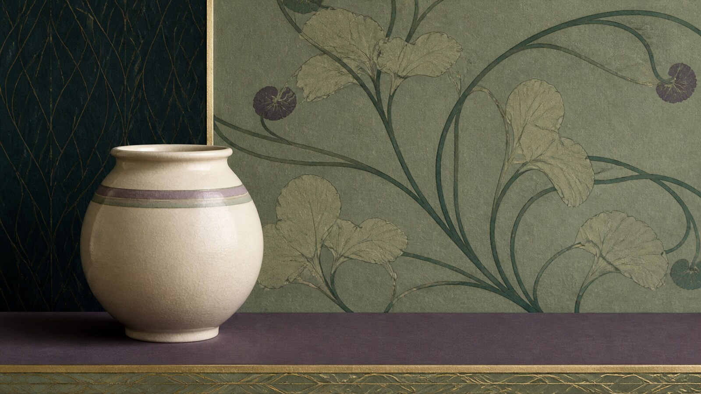

# 唯美主义

[English](README.en.md)

> **分类：** 艺术流派  
> **媒介领域：** 混合媒介  
> **目录：** `style-packages/movements/aestheticism`

## 简介

唯美主义强调“艺术为艺术而艺术”，把绘画、器物、空间、材质和图案看成一个整体环境。这个包提取的是装饰统一、感官表面、控制过的非对称和图案尺度关系，不等于某一间维多利亚客厅或某一种花纹。

## 策展短评

最有趣的地方，是主体和背景不再争抢主次，而是彼此成全。一个普通物件只要和周围的色彩、材质、边缘和留白建立了关系，就能显出完整的气质。使用时不必堆砌贵重装饰，先把整体节奏安排好，画面自然会变得精致。

## 主体独立性

本包只决定视觉处理，不决定物体、地点、图案或历史叙事。孔雀、日本器物、花卉墙纸和维多利亚空间都不是默认要求。

## 来源与版权

本包参考 [维多利亚与阿尔伯特博物馆唯美主义专题](https://www.vam.ac.uk/collections/aestheticism) 与 [大都会艺术博物馆艺术美学运动展览](https://www.metmuseum.org/exhibitions/listings/2016/aesthetic-movement) 提取可观察特征。外部作品仍归原权利人所有；仓库只保留链接，不复制原作或特定布局。

## 只使用此包

1. **交给有生图能力的 Agent：** 上传本目录，请 Agent 读取规则文件，先确认你的主体，再生成并按 `evaluation.yaml` 检查。
2. **复制 Prompt：** 用 `prompts/base.txt` 替换主体、地点、画幅和用途，把 `prompts/negative.txt` 一并提交。
3. **使用自己的 API：** 配置自己的 API Key，提交 Prompt、负面约束、调色板和参考链接。
4. **本地模型与 ComfyUI：** 接入 Prompt，按复现说明控制图案、材质、色彩与光线，生成后复核。

参考图只用于理解可观察特征，不复制原作的构图、人物、文字、商标或标志。
