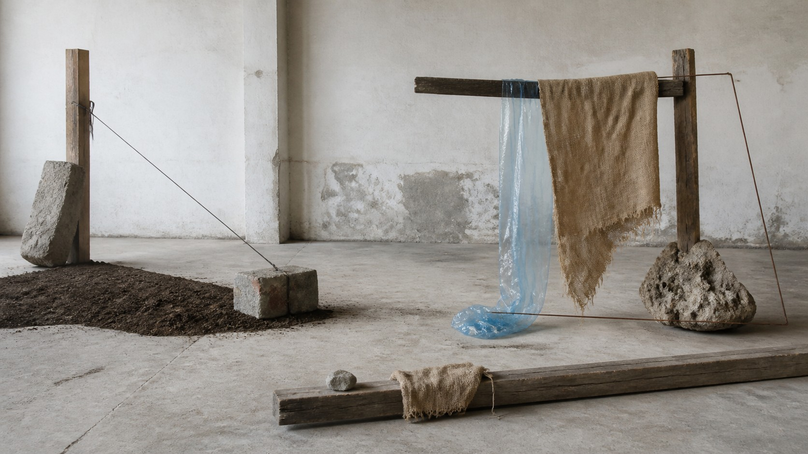

# Arte Povera

[中文](README.md)

> **Category:** Movement and period  
> **Domain:** Hybrid media  
> **Path:** `style-packages/movements/arte-povera`

## Overview

This package extracts non-precious materials, rough surfaces, temporary balance, natural change, and tension between materials. It makes the image attend to how things exist instead of arranging the result into polished beauty.

It does not require soil, stone, burlap, branches, wire, or a gallery in every generation. Your subject remains authoritative; the package controls material awareness, surface, space, and finish.

## Curatorial note

Arte Povera becomes powerful when material is no longer a passive support for form. Weight, fragility, corrosion, friction, and temporary connection can all become part of the image. The representative image uses very direct raw materials, but the transferable attitude is what matters: leave the traces intact and let matter speak about time and process.

## Subject independence

Your subject, people, objects, place, and narrative remain authoritative. This package controls material behavior, rough surface, temporary relations, spatial tension, and natural color. The installation and materials in the representative image are examples only and are not added to new generations.

## Read before use

- `identity.yaml`: scope and exclusions
- `visual-signature.yaml`: traits that survive a subject change
- `reproduction.yaml`: medium, materials, and build order
- `prompts/base.txt`, `prompts/negative.txt`: prompt constraints
- `palette/palette.json`: color roles
- `evaluation.yaml`: post-generation checks
- `references/manifest.csv`, `provenance.yaml`: sources and rights boundaries

## Sources and rights

Museum terms and collection materials are used to study observable traits. External works and their images remain the property of their rights holders; this package does not bundle external works or copy a specific composition, material combination, or mark. The representative image is a new anonymous scene and does not imply collaboration, authorization, or endorsement.

Source: [MoMA Arte Povera art term](https://www.moma.org/collection/terms/arte-povera). See [`provenance.yaml`](provenance.yaml), [`references/manifest.csv`](references/manifest.csv), and the repository [`NOTICE`](../../../NOTICE).

## Use only this package

### Method 1: Give the package to an image-capable Agent

Upload this directory or provide its local path. Ask the Agent to read the identity, visual signature, reproduction, prompt, palette, and evaluation files first, then compile your subject into a complete prompt. Tell it to use only the package’s material and surface rules, avoid forced soil, stone, and galleries, and review the result against `evaluation.yaml`.

### Method 2: Copy the prompts

Open `prompts/base.txt`, replace the subject, location, and aspect ratio, and send `prompts/negative.txt` as the negative prompt. Use the signature and palette for tighter control.

### Method 3: Submit through your own API tool

Configure an API key in your own image platform or compiler, then submit the base prompt, negative constraints, palette, and required reference list. This repository does not host a generation service or manage keys.

### Method 4: Local model + ComfyUI

Connect the prompts to a local model or ComfyUI workflow. Use the reproduction notes to set materials, contact, rough surface, and spatial tension, then review the output with `evaluation.yaml`.

Users manage model weights, keys, and generated images. References are for understanding traits, not for copying source works.
