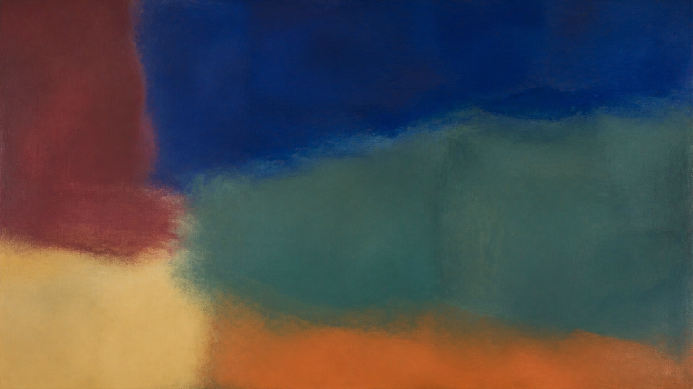

# Color Field Painting

[中文说明](README.md)

> **Category:** Art movement and historical period  
> **Medium:** Mid-century abstract painting  
> **Directory:** `style-packages/movements/color-field-painting`

## Overview

Color Field painting treats expansive, low-modulation areas of color as the structure of the image. The viewer does not have to search for a central object; space and emotion emerge from the proportions, boundaries, and adjacency of the fields. This package transfers the continuity and quiet weight of color. If the user supplies a concrete subject, the fields can frame, simplify, or support it without dissolving it into geometry.

## Curatorial note

What moves me here is that very little can still feel full. Once color spreads across the surface, proportion and boundary gradually become a kind of space. Do not reduce “large fields” to neat rectangles, and do not rush to add texture. Decide which color deserves time and attention first; the image often finds its rhythm from that decision.

## Subject independence

This package controls expansive fields, color proportion, boundaries, negative space, and low-density surface. It does not prescribe rectangles, circles, horizons, symbols, or a purely abstract output. The representative image is a non-objective color study; new generations still follow the user's subject and purpose.

## Sources and rights

The research entry is MoMA's [Color Field painting term](https://www.moma.org/collection/terms/color-field-painting). The repository does not bundle external artworks. The representative image is newly generated and anonymous, not a reproduction of a specific work and not an endorsement or collaboration.

## Use this package only

### Method 1: Give it to an image-capable Agent

Give this directory to an Agent. Ask it to read `identity.yaml`, `visual-signature.yaml`, `reproduction.yaml`, `prompts/`, `palette/palette.json`, and `evaluation.yaml`, then compile your subject, aspect ratio, and purpose. Review field continuity, subject preservation, and whether irrelevant texture has filled the image.

### Method 2: Copy the Prompt directly

Open `prompts/base.txt`, replace `{{SUBJECT}}`, `{{ASPECT_RATIO}}`, and `{{USE_CASE}}`, and submit `prompts/negative.txt` as well on platforms that support negative prompts.

### Method 3: Configure an API key and submit

Configure an API key in your own image service or compiler, then submit the base prompt, negative constraints, and palette. This repository does not host keys or an online image service.

### Method 4: Local model + ComfyUI

Connect the prompts, palette, and reproduction notes to a local model or ComfyUI workflow. Use `evaluation.yaml` for review; do not treat the abstract color fields in the representative image as the only possible subject.
