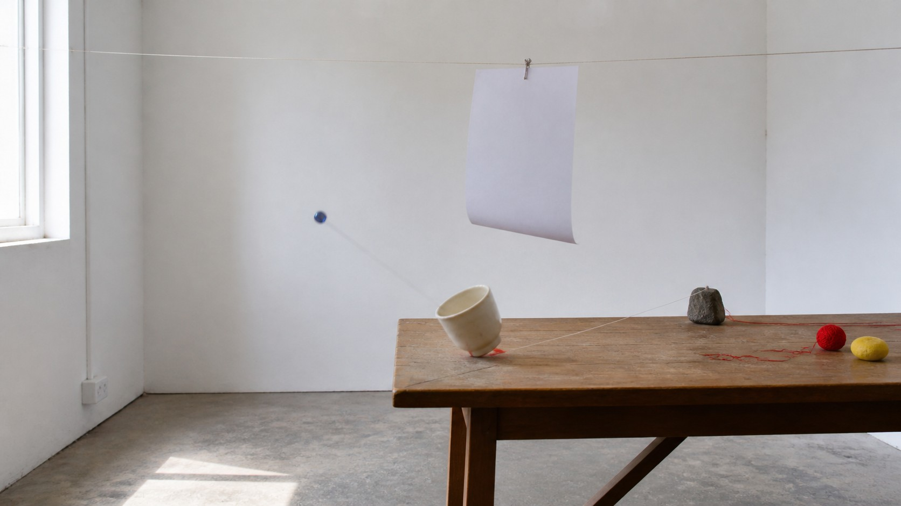

# Fluxus

[中文](README.md)

> **Category:** Movement and period  
> **Domain:** Hybrid media  
> **Path:** `style-packages/movements/fluxus`

## Overview

This package extracts event logic, everyday materials, simple actions, open interpretation, and an anti-polished presentation. It can make an image feel like a record of something that happened, or leave behind a visual relation that has not been fully explained.

It does not require a score card, performer, stage, paper, or particular prop set in every generation. Your subject remains authoritative; Fluxus contributes a way to organize ordinary things as a visual event.

## Curatorial note

What interests me in Fluxus is its refusal to rush toward a complete “work.” A small action, an unremarkable material, or an arrangement without a result can shift attention from the object to the question of what just happened. When using this package, the point is not to add quirky props, but to leave a traceable action line that does not need to be explained all the way.

## Subject independence

Your subject, people, objects, place, and narrative remain authoritative. This package controls event logic, composition, material evidence, light, surface, and openness. The table, paper, and cup in the representative image are examples only and are not added to new generations.

## Read before use

- `identity.yaml`: scope and exclusions
- `visual-signature.yaml`: traits that survive a subject change
- `reproduction.yaml`: medium, materials, and build order
- `prompts/base.txt`, `prompts/negative.txt`: prompt constraints
- `palette/palette.json`: color roles
- `evaluation.yaml`: post-generation checks
- `references/manifest.csv`, `provenance.yaml`: sources and rights boundaries

## Sources and rights

Exhibition and museum pages are used to study observable traits. External works and their images remain the property of their rights holders; this package does not bundle external works or copy a specific composition, text, or mark. The representative image is a new anonymous scene and does not imply collaboration, authorization, or endorsement.

Source: [The Museum of Modern Art, At the Border of Art and Life](https://www.moma.org/calendar/galleries/5121). See [`provenance.yaml`](provenance.yaml), [`references/manifest.csv`](references/manifest.csv), and the repository [`NOTICE`](../../../NOTICE).

## Use only this package

### Method 1: Give the package to an image-capable Agent

Upload this directory or provide its local path. Ask the Agent to read the identity, visual signature, reproduction, prompt, palette, and evaluation files first, then compile your subject into a complete prompt. Tell it to use only the package’s event and visual rules, avoid forced score cards, performers, and fixed props, and review the result against `evaluation.yaml`.

### Method 2: Copy the prompts

Open `prompts/base.txt`, replace the subject, location, and aspect ratio, and send `prompts/negative.txt` as the negative prompt. Use the signature and palette for tighter control.

### Method 3: Submit through your own API tool

Configure an API key in your own image platform or compiler, then submit the base prompt, negative constraints, palette, and required reference list. This repository does not host a generation service or manage keys.

### Method 4: Local model + ComfyUI

Connect the prompts to a local model or ComfyUI workflow. Use the reproduction notes to set the action trace, material, light, and open space, then review the output with `evaluation.yaml`.

Users manage model weights, keys, and generated images. References are for understanding traits, not for copying source works.
