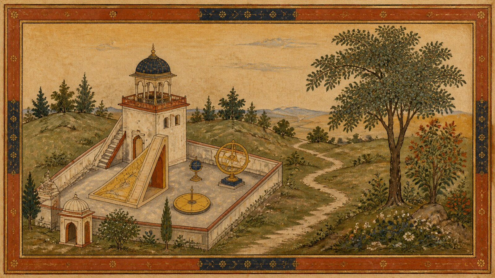

# 莫卧儿细密画

[English](README.en.md)

> **分类：** 艺术流派与历史时期　**媒介：** 纸本不透明水彩与墨线　**目录：** `style-packages/movements/mughal-miniature-painting`

## 简介

莫卧儿细密画把精确的轮廓、纸本色彩、层叠的浅空间和自然观察结合起来。画面可以容纳很多细节，但每一层的边界、尺度和留白都经过控制。这个包关注的是纸面、笔触和空间组织，不把宫廷故事当成必需内容。

## 策展短评

它的秩序感不是来自空旷，而是来自“每个小地方都有自己的位置”。我喜欢先搭出边框和几层平面，再把细节集中到少数区域；这样既有手工密度，也不会因为到处都很满而失去呼吸。

## 主体独立性

本包只决定纸本媒介、轮廓、层叠空间、色彩和细节密度。宫殿、皇帝、狩猎、花园、动物和文字都不是默认主体。

## 文件导航

- `identity.yaml`：来源、范围和主体边界
- `visual-signature.yaml`：轮廓、空间、色彩和细节层级
- `reproduction.yaml`：从边框到局部细节的构建顺序
- `prompts/`：基础 Prompt 与负面约束
- `palette/palette.json`：色彩角色
- `evaluation.yaml`：主体独立性与视觉签名检查
- `references/manifest.csv`、`provenance.yaml`：参考来源和权利边界

## 来源与版权

本包参考[大都会艺术博物馆的《沙贾汗相册》资料](https://www.metmuseum.org/essays/the-shah-jahan-album)和[皇家狩猎绘画介绍](https://www.metmuseum.org/zh/perspectives/depicting-the-royal-hunt)，提取可观察的纸本、轮廓和细密绘画方法。馆藏作品归原权利人所有；代表图是新的匿名场景，不是历史画页复制品，也不代表博物馆或相关艺术家的授权、合作或背书。

## 只使用此包

### 方式一：交给有生图能力的 Agent

把本目录交给 Agent，要求它先读取身份、视觉签名、复现说明、Prompt、调色板和评价文件，再将你的主体、地点、画幅和用途编译成任务。提醒它不要把宫殿、皇室、狩猎、花园或文字当成默认要求。

### 方式二：直接复制 Prompt

复制 `prompts/base.txt`，替换 `{SUBJECT}` 和 `{LOCATION}`；同时提交 `prompts/negative.txt`。需要更多纸面和细节控制时，参考视觉签名和调色板。

### 方式三：配置 API Key 后提交生成

在你自己的生图平台或编译工具中配置 API Key，把基础 Prompt、负面约束和调色板一起提交。本仓库不托管密钥或在线生图服务。

### 方式四：本地模型 + ComfyUI

把基础 Prompt 和负面约束接入本地模型或 ComfyUI，按复现说明设置纸面、轮廓、浅空间和局部细节，生成后用 `evaluation.yaml` 复核。

模型权重、API Key 和生成图片由使用者自行管理。参考图只用于理解视觉特征，不要复制原作画页、人物、文字、商标或标志。
