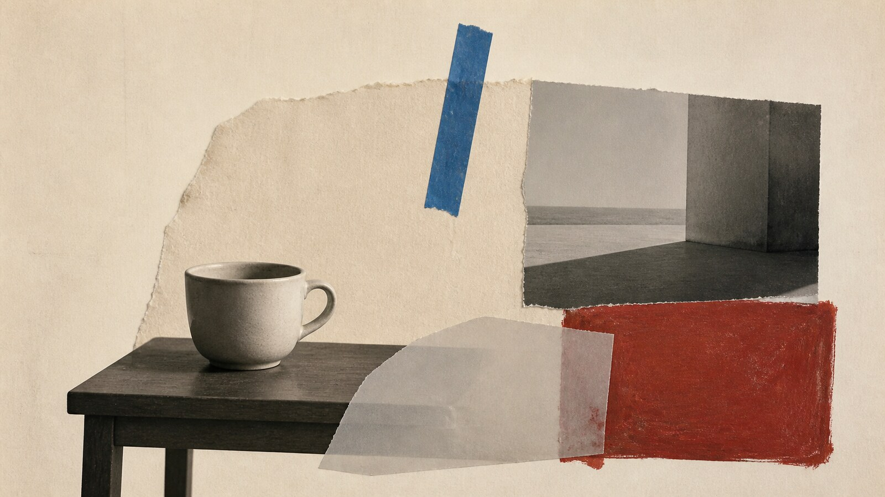

# 新达达

[English](README.en.md)

> **分类：** movement
> **媒介领域：** hybrid
> **目录：** style-packages/movements/neo-dada

## 简介

以现成物、拼贴、偶发动作与媒介混用打破艺术品和日常物之间的边界，保持反权威的实验感。

这是一个可独立使用的风格包。它提取可观察的视觉语言，用来处理用户指定的新主题，不会把代表图中的物体、地点、人物或故事写入默认生成结果。

## 策展短评

新达达不是单纯的“乱”，而是让纸、照片、胶带和颜料保留自己的身份。给它一个清楚的主体，再留一点不合时宜的介入，画面会比符号堆积更有张力。

## 主体独立性

本包只决定“怎么生成”，不决定“生成什么”。人物、物体、地点、建筑、植物、车辆和叙事由你的 Prompt 决定；代表图只用于展示视觉处理，不是固定题材模板。

## 来源与版权

参考资料只用于研究和分析。外部作品、摄影作品、游戏画面、商标和平台页面仍归原权利人所有。生成示例是新的匿名场景，不是相关艺术家、摄影师、流派、技法或游戏的原作，也不代表合作、授权或背书关系。

详细来源见 provenance.yaml 和 references/manifest.csv。

## 只使用此包

### 方式一：交给有生图能力的 Agent

把本目录交给 Agent，并要求它先读取 identity.yaml、visual-signature.yaml、reproduction.yaml、prompts/base.txt、prompts/negative.txt、palette/palette.json 和 evaluation.yaml，再把你的主体、地点、画幅和用途编译进完整 Prompt。生成后按 evaluation.yaml 检查，不要复制参考作品。

### 方式二：直接复制 Prompt

打开 prompts/base.txt，替换主体、地点和画幅要求；把 prompts/negative.txt 一起交给支持负面 Prompt 的生图平台。

### 方式三：配置 API Key 后提交生成

在你自己的生图平台或编译工具中配置 API Key，将基础 Prompt、负面约束、调色板和参考清单一起提交。密钥与生成图片由你自己管理，本仓库不托管在线生图服务。

### 方式四：本地模型与 ComfyUI

将基础 Prompt 和负面约束接入本地模型或 ComfyUI 工作流，按 visual-signature.yaml、reproduction.yaml 和 palette/palette.json 设置视觉参数，生成后用 evaluation.yaml 复核。
