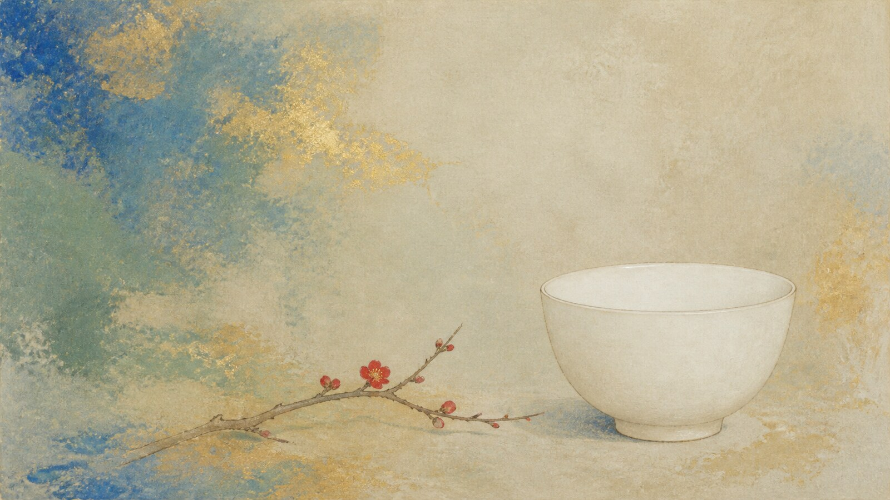

# Nihonga

[中文](README.md)

> **Category:** Movement and period  · **Medium:** 绘画
> **Directory:** style-packages/movements/nihonga

## Overview

以纸、绢、矿物颜料、蛤粉与胶为材料基础，结合细线、平静留白、自然观察和层叠色面形成现代日本绘画语言。

## A short note

日本画材料、传统来源和现代转化形成的含蓄绘画语言. The package is best understood as a transferable set of visual decisions: 材料逻辑明确的纸绢吸收感, supported by light, surface, and spatial structure. It extracts observable traits without importing the subject, composition, or story of a source work.

## Visual signature

- 材料逻辑明确的纸绢吸收感
- 矿物色层与大面积留白
- 细线、平涂与自然观察共同工作
- 金色和蛤粉只作为局部材料节点

## Subject independence

This package controls visual treatment only. It does not choose the user's people, objects, locations, quantities, actions, or story. The representative image and benchmark subject are demonstrations, not default generation requirements. No landmark, character, building, prop, game level, or narrative event is inserted automatically.

## Sources and rights

Sources are used for research and attribution. External artworks, photographs, game images, trademarks, and platform pages remain with their respective rights holders. The generated example is an original anonymous scene, not an original work by the referenced artist, photographer, movement, technique, or game, and does not imply endorsement or affiliation.

- [About Nihonga](https://www.yamatane-museum.jp/en/nihonga/)

See [provenance.yaml](provenance.yaml), [references/manifest.csv](references/manifest.csv), and the repository NOTICE (../../../NOTICE) for source and redistribution notes.

## Use this package only

Choose one of the following methods; they are alternatives rather than steps to perform all at once.

### Method 1: Give the package to an image-capable Agent

Upload the package directory or provide its local path. Ask the Agent to read identity.yaml, visual-signature.yaml, reproduction.yaml, prompts/base.txt, prompts/negative.txt, palette/palette.json, and evaluation.yaml; compile the rules into your request, avoid copying reference art, generate the image, and review it against evaluation.yaml.

### Method 2: Copy the prompt directly

Open [prompts/base.txt](prompts/base.txt), replace the subject, objects, scene, and aspect ratio, and submit it with [prompts/negative.txt](prompts/negative.txt) to a text-to-image platform.

### Method 3: Configure an API key and submit a generation task

Configure an API key in your own image service or prompt compiler, then submit the base prompt, negative constraints, palette, and reference manifest. This repository does not manage secrets or host an online image service.

### Method 4: Local model + ComfyUI

Connect the base prompt and negative constraints to a local model or ComfyUI workflow. Use the palette and reproduction notes to set color, composition, material, and light. Review the output with [evaluation.yaml](evaluation.yaml).

Model weights, API keys, and generated images remain the user's responsibility. References explain observable features; do not copy a source work's exact composition, person, text, trademark, or logo.
