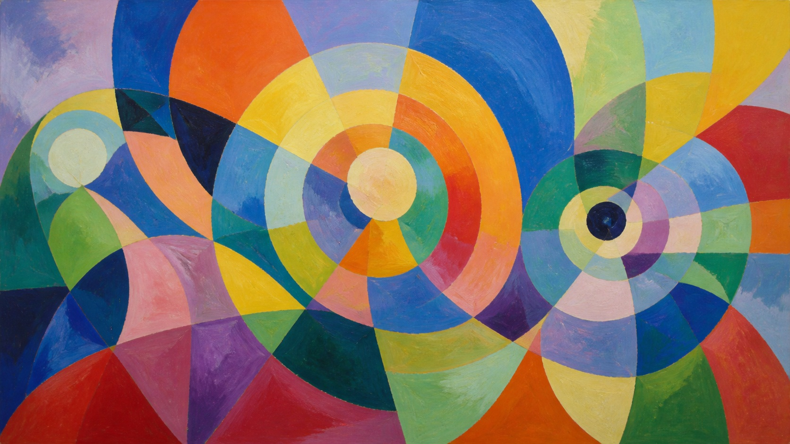

# Orphism

[中文说明](README.md)

> **Category:** Art movement and historical period  
> **Medium:** Early modernist color abstraction  
> **Directory:** `style-packages/movements/orphism`

## Overview

Orphism treats color, circular rhythm, and interlocking planes as structure. It does not require a story, nor does every image need a sun, planet, or record. This package focuses on how colors push against one another, how planes lock together, and how abstraction can serve the user's subject.

## Curatorial note

What I enjoy about Orphism is that light does not have to come from a lamp. Neighboring blue and orange, or red and green, can raise each other's intensity; arcs and fan shapes move the eye like a musical rhythm. Do not break every subject into geometry. Preserve the subject, then let color relationships and local rhythm change how it is seen.

## Subject independence

This package controls color contrast, circular rhythm, painted plane boundaries, and limited material variation. It does not prescribe a sun, planet, window, record, cosmos, or any other fixed object. The abstract city profile in the representative image is only a benchmark subject.

## Sources and rights

Research begins with MoMA's [Orphism term entry](https://www.moma.org/collection/terms/orphism) and the [Robert Delaunay work record](https://www.moma.org/collection/works/78302). The repository does not bundle external artworks. The representative image is newly generated and anonymous, not a reproduction of a specific work and not an endorsement or collaboration.

## Use this package only

### Method 1: Give it to an image-capable Agent

Give this directory to an Agent. Ask it to read `identity.yaml`, `visual-signature.yaml`, `reproduction.yaml`, `prompts/`, `palette/palette.json`, and `evaluation.yaml`, then compile your subject, aspect ratio, and purpose. Review whether color carries structure, the subject remains readable, and no unnecessary fixed motif has appeared.

### Method 2: Copy the Prompt directly

Open `prompts/base.txt`, replace `{{SUBJECT}}`, `{{ASPECT_RATIO}}`, and `{{USE_CASE}}`, and submit `prompts/negative.txt` as well on platforms that support negative prompts.

### Method 3: Configure an API key and submit

Configure an API key in your own image service or compiler, then submit the base prompt, negative constraints, and palette. This repository does not host keys or an online image service.

### Method 4: Local model + ComfyUI

Connect the prompts, palette, and reproduction notes to a local model or ComfyUI workflow. Use `evaluation.yaml` for review; do not treat the city profile in the representative image as a default subject.
