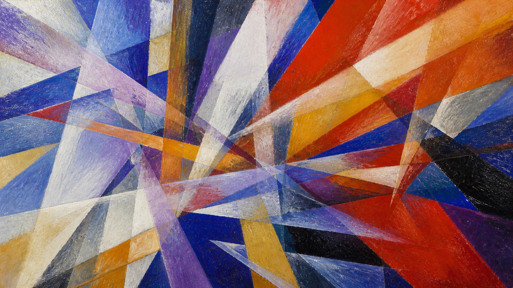

# Rayonism

[中文版](README.md)

> **Category:** Art movement and historical period  
> **Medium:** Early twentieth-century Russian avant-garde painting  
> **Directory:** style-packages/movements/rayonism

## Overview

Rayonism turns rays, movement, and color into an independent pictorial structure. It is not a centered sunburst or a generic radial gradient. The key is how directional bundles cross one another and how translucent color fields break a subject into new spatial relations.

## Curatorial note

This package is useful when abstraction should do more than produce attractive color. Color must carry direction, lines must carry space, and the subject should keep a traceable skeleton even after being broken apart. The subject can remain ordinary; the change happens in the act of looking.

## Subject independence

This package controls avant-garde painting media, crossing ray bundles, color-field overlap, and painted surface. It does not prescribe a person, object, place, or story. The abstract color field in the representative image is a benchmark subject only.

## Sources and rights

Research begins with the [National Galleries of Scotland Rayonism glossary](https://www.nationalgalleries.org/art-and-artists/glossary-terms/rayismrayonism) and a [Museum of Modern Art collection record](https://www.moma.org/collection/works/80480?sov_referrer=theme&theme_id=5102). No external artwork is bundled. The representative image is a new anonymous abstraction, not a reproduction of a specific work and not an endorsement or affiliation.

## Use only this package

### Method 1: Give the package to an image-capable Agent

Give the complete package directory to an Agent. Ask it to read identity.yaml, visual-signature.yaml, reproduction.yaml, prompts, palette/palette.json, and evaluation.yaml, then compile your subject, aspect ratio, and purpose into the generation task.

### Method 2: Copy the prompt

Copy prompts/base.txt, replace the subject and aspect ratio, and submit prompts/negative.txt with it.

### Method 3: Configure an API key

Configure an API key in your own image service or compiler, then submit the base prompt, negative constraints, and palette. This repository does not host keys or an online image service.

### Method 4: Local model + ComfyUI

Connect the prompt, palette, and reproduction notes to a local model or ComfyUI. Use evaluation.yaml to check directional crossings, color-field layers, painted surface, and subject leakage.
