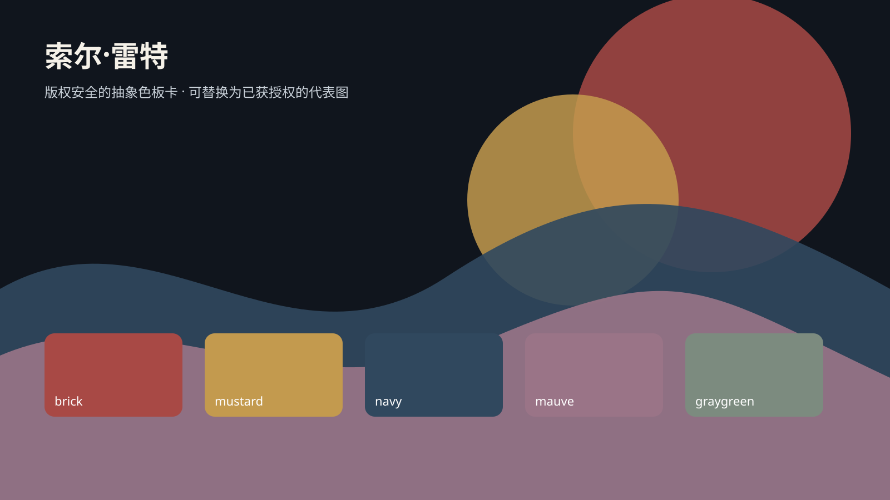
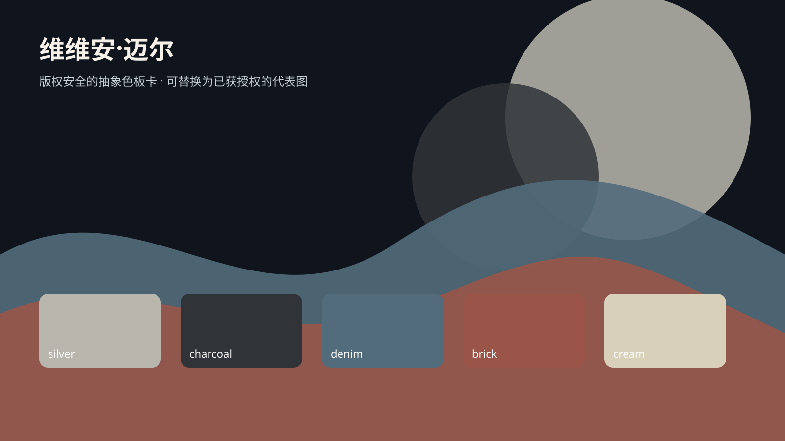
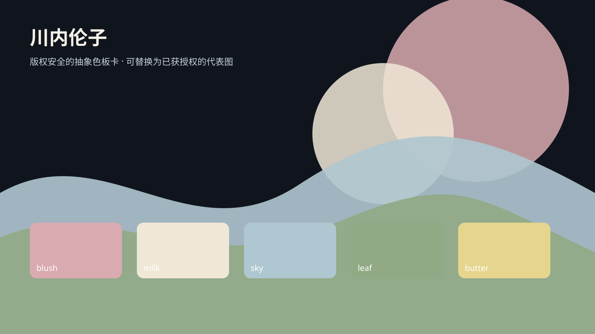

# Photographers

[中文](README.md)

This directory contains 20 independent style packages. Each card uses a horizontal 16:9 representative image; click an image or name to open the package README.

<table>
<tr>
<td width="33%" valign="top" align="center"> <strong>Henri Cartier-Bresson</strong> <a href="henri-cartier-bresson/README.en.md">Open README</a></td>
<td width="33%" valign="top" align="center"> <strong>Lewis Hine</strong> <a href="lewis-hine/README.en.md">Open README</a></td>
<td width="33%" valign="top" align="center"> <strong>Eadweard Muybridge</strong> <a href="eadweard-muybridge/README.en.md">Open README</a></td>
</tr>
<tr>
<td width="33%" valign="top" align="center"> <strong>Dorothea Lange</strong> <a href="dorothea-lange/README.en.md">Open README</a></td>
<td width="33%" valign="top" align="center"> <strong>William Eggleston</strong> <a href="william-eggleston/README.en.md">Open README</a></td>
<td width="33%" valign="top" align="center"> <strong>Ansel Adams</strong> <a href="ansel-adams/README.en.md">Open README</a></td>
</tr>
<tr>
<td width="33%" valign="top" align="center"> <strong>Julia Margaret Cameron</strong> <a href="julia-margaret-cameron/README.en.md">Open README</a></td>
<td width="33%" valign="top" align="center"> <strong>Daido Moriyama</strong> <a href="daido-moriyama/README.en.md">Open README</a></td>
<td width="33%" valign="top" align="center"> <strong>Eugène Atget</strong> <a href="eugene-atget/README.en.md">Open README</a></td>
</tr>
<tr>
<td width="33%" valign="top" align="center"> <strong>Walker Evans</strong> <a href="walker-evans/README.en.md">Open README</a></td>
<td width="33%" valign="top" align="center"> <strong>Masahisa Fukase</strong> <a href="masahisa-fukase/README.en.md">Open README</a></td>
<td width="33%" valign="top" align="center"> <strong>Nadar</strong> <a href="nadar/README.en.md">Open README</a></td>
</tr>
<tr>
<td width="33%" valign="top" align="center"> <strong>Robert Capa</strong> <a href="robert-capa/README.en.md">Open README</a></td>
<td width="33%" valign="top" align="center"> <strong>Roger Fenton</strong> <a href="roger-fenton/README.en.md">Open README</a></td>
<td width="33%" valign="top" align="center"> <strong>Étienne-Jules Marey</strong> <a href="etienne-jules-marey/README.en.md">Open README</a></td>
</tr>
<tr>
<td width="33%" valign="top" align="center"> <strong>Alfred Stieglitz</strong> <a href="alfred-stieglitz/README.en.md">Open README</a></td>
<td width="33%" valign="top" align="center"> <strong>Diane Arbus</strong> <a href="diane-arbus/README.en.md">Open README</a></td>
<td width="33%"></td>
</tr>
</table>

## Added in this batch

These packages use rights-safe abstract palette cards temporarily; replace them after an authorized or independently generated representative image is reviewed.

<table>
<tr><td width="33%" valign="top" align="center"> <strong>Saul Leiter</strong> <a href="saul-leiter/README.en.md">Open README</a></td><td width="33%" valign="top" align="center"> <strong>Vivian Maier</strong> <a href="vivian-maier/README.en.md">Open README</a></td><td width="33%" valign="top" align="center"> <strong>Rinko Kawauchi</strong> <a href="rinko-kawauchi/README.en.md">Open README</a></td></tr>
</table>
