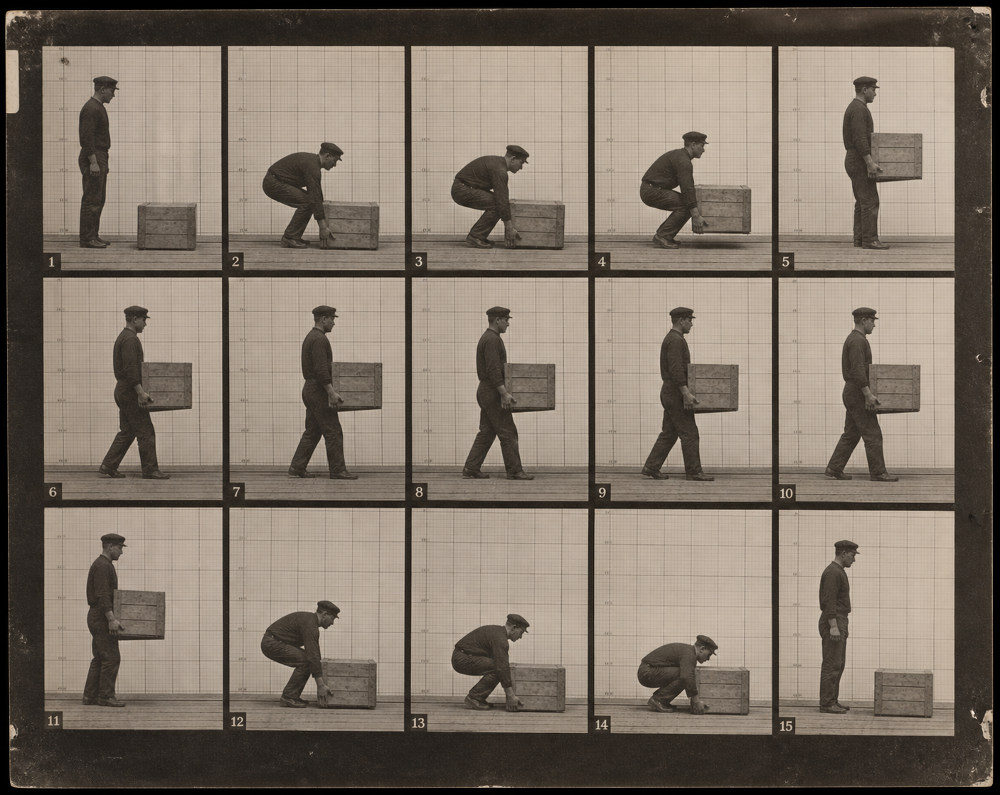
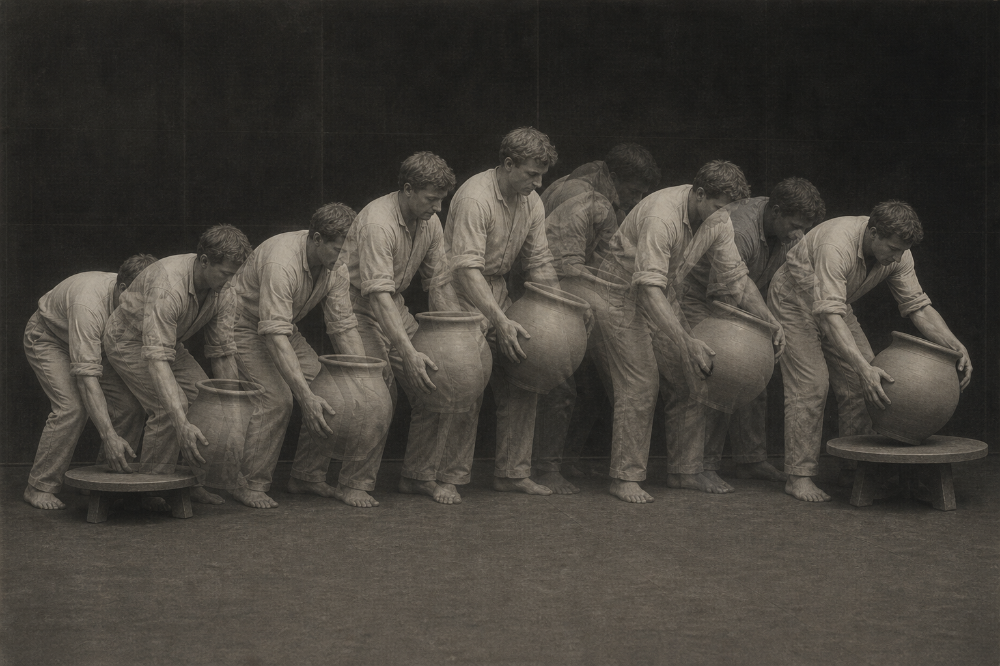
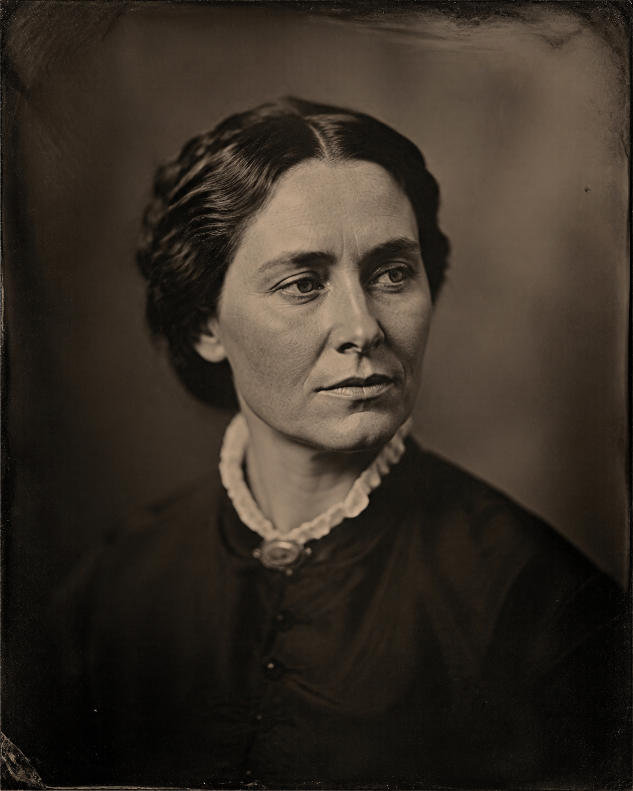
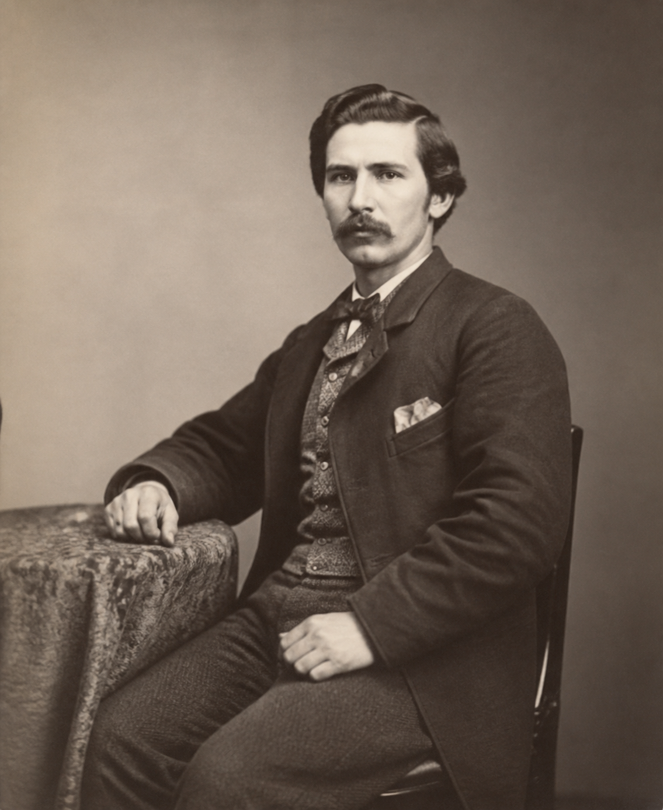
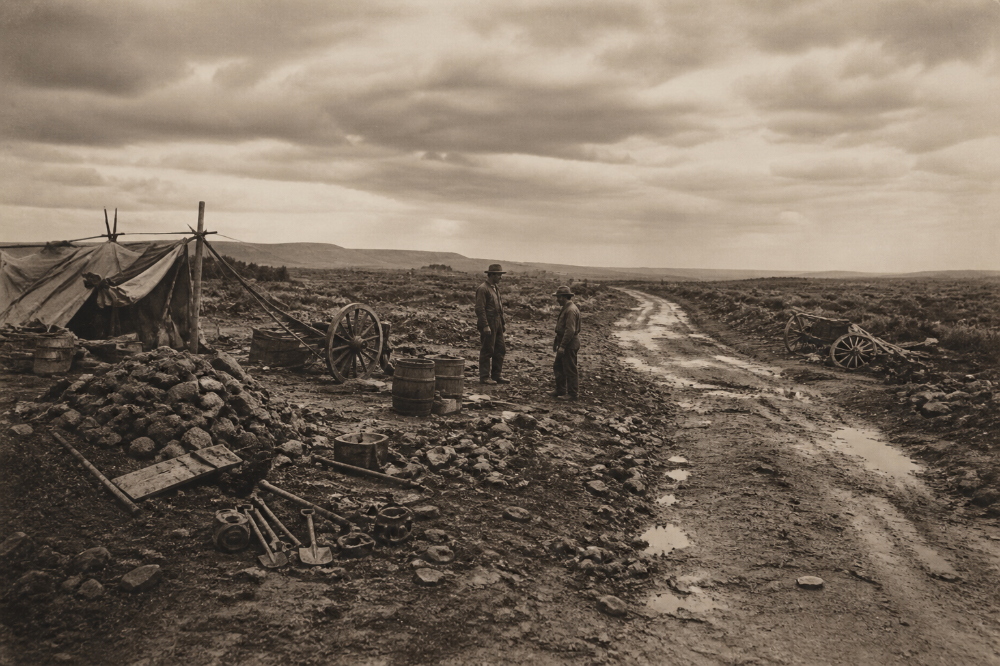

# 摄影师 / Photographers

本目录收录 9 个独立风格包。每个小单元都有代表图、名称和双语 README；点击 README 可查看来源、版权边界和三种使用方式。

This directory contains 9 independent style packages. Each package has a representative image, a bilingual README, provenance notes, and three usage modes.

<table>
<tr>
<td width="33%" valign="top" align="center">
 
<strong>Alfred Stieglitz</strong> 
<a href="alfred-stieglitz/README.md">打开 README / Open README</a>
</td>
<td width="33%" valign="top" align="center">
 
<strong>Eadweard Muybridge</strong> 
<a href="eadweard-muybridge/README.md">打开 README / Open README</a>
</td>
<td width="33%" valign="top" align="center">
 
<strong>Étienne-Jules Marey</strong> 
<a href="etienne-jules-marey/README.md">打开 README / Open README</a>
</td>
</tr>
<tr>
<td width="33%" valign="top" align="center">
 
<strong>Eugène Atget</strong> 
<a href="eugene-atget/README.md">打开 README / Open README</a>
</td>
<td width="33%" valign="top" align="center">
 
<strong>Julia Margaret Cameron</strong> 
<a href="julia-margaret-cameron/README.md">打开 README / Open README</a>
</td>
<td width="33%" valign="top" align="center">
 
<strong>Lewis Hine</strong> 
<a href="lewis-hine/README.md">打开 README / Open README</a>
</td>
</tr>
<tr>
<td width="33%" valign="top" align="center">
 
<strong>Masahisa Fukase</strong> 
<a href="masahisa-fukase/README.md">打开 README / Open README</a>
</td>
<td width="33%" valign="top" align="center">
 
<strong>Nadar</strong> 
<a href="nadar/README.md">打开 README / Open README</a>
</td>
<td width="33%" valign="top" align="center">
 
<strong>Roger Fenton</strong> 
<a href="roger-fenton/README.md">打开 README / Open README</a>
</td>
</tr>
</table>
