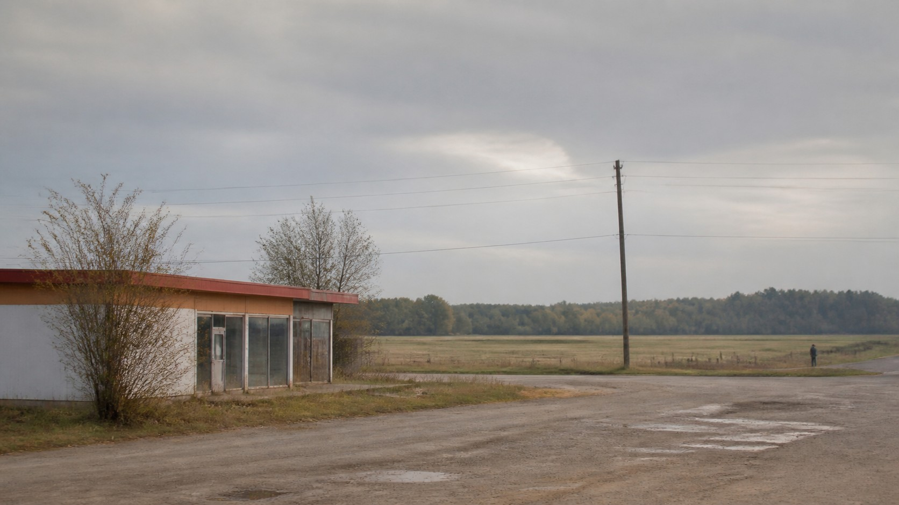

# Alec Soth

[中文](README.md)

> **Category:** Photographer  
> **Medium:** Photography  
> **Directory:** `style-packages/photographers/alec-soth`

## Overview

This package extracts patient large-format color observation, ordinary places, generous negative space, and a quiet distance between people and their surroundings. It allows mild awkwardness without relying on a dramatic event.

## Curatorial note

This approach rarely rushes to explain a place. Roads, buildings, sky, and distant people keep their own space, and the unfilled areas create the aftertaste. The representative image uses an edge-of-town site to show that relationship. When the subject changes, keep the patience that lets place and subject speak together—not a road, a rural setting, or a national icon.

## Subject independence

The package controls observation, space, light, color, and photographic surface. It does not require roads, motels, prairies, flags, American locations, or lonely people. The building and distant person in the representative image are examples only; the user's subject remains authoritative.

## Source and rights

The package uses [Alec Soth's official biography](https://alecsoth.com/photography/about) for research and extracts observable photographic characteristics only. External photographs remain with their rights holders. The representative image is an original scene, not a reproduction or endorsement. See [`provenance.yaml`](provenance.yaml), [`references/manifest.csv`](references/manifest.csv), and the root [`NOTICE`](../../../NOTICE).

## Use only this package

1. **Give it to an image-capable Agent:** provide this directory and ask the Agent to read the identity, visual signature, reproduction, prompts, palette, and evaluation files before compiling your subject-specific prompt.
2. **Copy the Prompt:** replace `{SUBJECT}` and `{LOCATION}` in `prompts/base.txt`, and submit `prompts/negative.txt` as the negative prompt.
3. **Use your own API key:** submit the base prompt, negative constraints, palette, and relevant references through your chosen service. This repository does not host keys or image generation.
4. **Use a local model + ComfyUI:** wire the prompts into your workflow, reproduce the distance, negative space, daylight, and film-surface rules, then review with `evaluation.yaml`.

Models, keys, and generated images remain under the user's control. References are for feature analysis, not copying.
