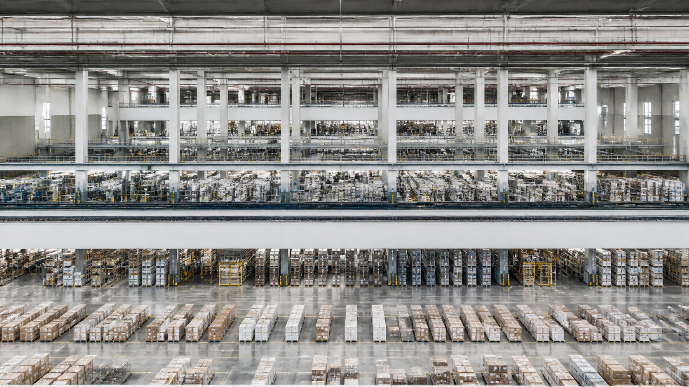

# 安德烈亚斯·古尔斯基

[English](README.en.md)

> **分类：** 摄影师  
> **媒介领域：** 当代大画幅色彩摄影  
> **目录：** `style-packages/photographers/andreas-gursky`

## 简介

安德烈亚斯·古尔斯基的照片常把观看距离拉远，让建筑、设施、自然地貌或人群呈现出近似系统图的整体秩序。重复模块、水平色带和局部细节同时存在，画面既像一张巨大的地图，也保留了一个个可辨认的单元。本包提取这种尺度感、信息密度和色彩组织，不把仓库、停车场或办公室写成固定题材。

## 策展短评

我喜欢这类照片里“远看很有秩序，近看仍然有生活痕迹”的反差。它不急着把某个物件拍成主角，而是让主体在整体结构里找到位置。使用时可以先观察用户对象本身有没有重复、分层或队列，再决定要不要拉高视点；如果主体没有这些条件，就保留清晰的整体构图，不要硬塞一个网格。

## 主体独立性

本包只决定观看距离、尺度关系、重复结构、色彩分区和摄影解析度，不规定人物、建筑、设施、地点或故事。代表图中的物流空间只是测试主体，新的生成应以用户需求为准。

## 来源与版权

研究入口为[现代艺术博物馆的相关展览档案](https://www.moma.org/calendar/exhibitions/170)。仓库不打包外部作品；代表图是新的匿名场景，不是具体原作，也不表示合作、授权或背书关系。

## 只使用此包

### 方式一：交给有生图能力的 Agent

把本目录交给 Agent，让它先读取 `identity.yaml`、`visual-signature.yaml`、`reproduction.yaml`、`prompts/`、`palette/palette.json` 和 `evaluation.yaml`，再编译你的主体、画幅和用途。生成后按评价文件检查主体独立性、尺度关系和重复结构是否服务于主体。

### 方式二：直接复制 Prompt

打开 `prompts/base.txt`，替换 `{{SUBJECT}}`、`{{ASPECT_RATIO}}` 和 `{{USE_CASE}}`；把 `prompts/negative.txt` 一并提交给支持负面 Prompt 的平台。

### 方式三：配置 API Key 后提交生成

在你自己的生图平台或编译工具中配置 API Key，提交基础 Prompt、负面约束和调色板。本仓库不托管密钥或在线生图服务。

### 方式四：本地模型 + ComfyUI

将 Prompt、调色板和复现说明接入本地模型或 ComfyUI，生成后用 `evaluation.yaml` 复核，不要把代表图的物流空间当成默认主体。
