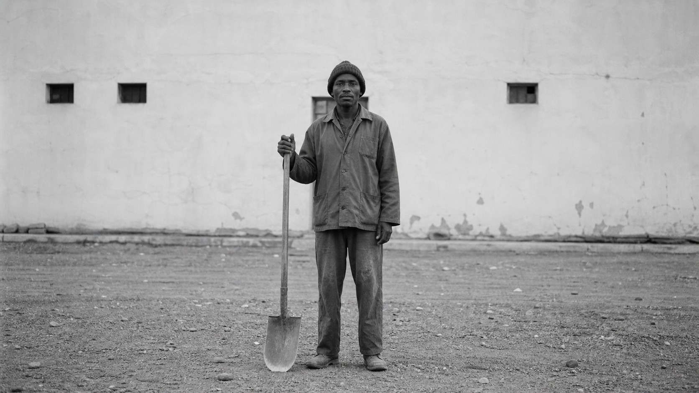

# 奥古斯特·桑德

[English](README.en.md)

> **分类：** 摄影师  
> **媒介领域：** 摄影  
> **目录：** `style-packages/photographers/august-sander`

## 简介

这个包提取正面、清晰、分类式的纪实观察。人物的服饰、姿态、工具和周围环境共同构成肖像，摄影不急着追求戏剧表情，而是让社会身份和材料细节慢慢显现。

## 策展短评

桑德的肖像有一种近乎档案的耐心：一个人站在哪里、穿什么、手里拿着什么，和他的脸一样重要。代表图用匿名劳动者展示这种关系，但并不要求每次都生成工人或制服。真正值得迁移的是让主体和语境共同承担信息，而不是套上一层黑白滤镜。

## 主体独立性

本包只决定纪实观察、姿态、环境比例、光线和影调，不规定工人、职业、制服、德国地点或正面肖像。代表图中的人物和工具只是示例，使用者提供的主体优先。

## 使用前先看

- `identity.yaml`：范围与排除项
- `visual-signature.yaml`：换主体后仍应保留的视觉特征
- `reproduction.yaml`：摄影构建顺序
- `prompts/base.txt`、`prompts/negative.txt`：基础约束
- `palette/palette.json`：色彩角色
- `evaluation.yaml`：生成后的检查标准
- `references/manifest.csv`、`provenance.yaml`：来源与权利边界

## 来源与版权

本包参考[奥古斯特·桑德基金会的生平资料](https://augustsander.org/page/biography)，只提取可观察的摄影特征。外部照片及其图像权利仍归原权利人所有；代表图是新的原创匿名场景，不复制具体照片，也不表示与摄影师、基金会或机构存在合作、授权或背书关系。详细边界见 [`provenance.yaml`](provenance.yaml)、[`references/manifest.csv`](references/manifest.csv) 和仓库根目录的 [`NOTICE`](../../../NOTICE)。

## 只使用此包

四种方式任选其一：

1. **交给有生图能力的 Agent**：把本目录交给 Agent，要求先读取身份、视觉签名、复现说明、Prompt、调色板和评估文件，再把你的主题编译成完整 Prompt；生成后按 `evaluation.yaml` 复核。
2. **直接复制 Prompt**：打开 `prompts/base.txt`，替换 `{SUBJECT}` 与 `{LOCATION}`；将 `prompts/negative.txt` 一并提交。
3. **配置 API Key 后提交生成**：在你自己的平台或编译工具中配置 API Key，提交基础 Prompt、负面约束、调色板和必要参考清单。本仓库不托管密钥或在线生图服务。
4. **本地模型 + ComfyUI**：把基础 Prompt 和负面约束接入工作流，按复现说明设置姿态、环境、影调和材料细节；生成后用 `evaluation.yaml` 复核。

模型权重、密钥和生成图片由使用者自行管理。参考资料用于理解特征，不用于复制原作。
