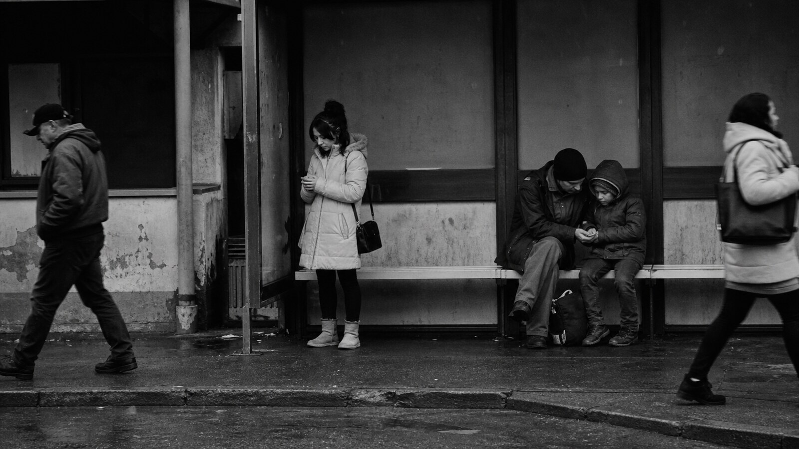

# Bruce Davidson

[中文版](README.md)

> **Category:** Photographer  · **Domain:** photography
> **Path:** style-packages/photographers/bruce-davidson

## Overview

以长期观察、贴近主体的人文距离、深沉影调和系列化现场感记录普通生活中的尊严与张力。

## Notes

戴维森的力量来自持续靠近和长时间相处，而不是一次性的猎奇瞬间。这个包强调人与环境的关系、深沉影调和现场尊严，不自动加入纽约、街头团体或特定社会事件。

## Visual signature

- 贴近主体但不侵入的观察距离
- 深沉黑白或低彩度影调
- 系列化现场感和环境中的人物关系
- 普通生活里的尊严、疲惫和微妙张力

## Subject independence

This package controls visual treatment, not the user's subject, object count, location, or story. The representative image is an anonymous demonstration. It does not add a recurring landmark, character, prop, or narrative event.

## Sources and rights

Research sources are linked for study and attribution. External works, photographs, game materials, trademarks, and platform pages remain with their respective rights holders. The generated demonstration is original and anonymous, not a source artwork or endorsement.

- [布鲁斯·戴维森摄影师资料](https://pro.magnumphotos.com/C.aspx?ERID=24KL53ZTH6&VF=MAGO31_9_VForm&VP3=CMS3)

See [provenance.yaml](provenance.yaml), [references/manifest.csv](references/manifest.csv), and the repository [NOTICE](../../../NOTICE).

## Use only this package

四种方式可以按手边工具任选其一，不需要同时使用。

### Method 1: Give the package to an image-capable Agent

把整个风格包目录上传给 Agent，或把本地目录路径交给它，并附上：

~~~
请使用这个风格包帮助我生成图片。
请先读取 identity.yaml、visual-signature.yaml、reproduction.yaml、prompts/base.txt、
prompts/negative.txt、palette/palette.json 和 evaluation.yaml。
请把文件中的规则整合到生成流程中，不要只把风格名称当作 Prompt，也不要复制参考作品。
我的生成需求是：<填写人物、物体、场景、画幅和用途>
请先编译完整 Prompt，再调用你的生图能力。生成后按照 evaluation.yaml 检查风格特征、
构图、颜色、材质、AI 痕迹和需求遵循度，并说明仍然存在的风险。
~~~

### Method 2: Copy the Prompt

打开 [prompts/base.txt](prompts/base.txt)，替换主题、人物、物体、场景和画幅；将 [prompts/negative.txt](prompts/negative.txt) 作为负面 Prompt 一并提交到支持文本生图的平台。

### Method 3: Generate through your own API

在你自己的生图平台或编译工具中配置 API Key，将基础 Prompt、负面约束、调色板和必要的参考清单一起提交。本仓库不代管密钥、不托管在线生图服务。

### Method 4: Local model + ComfyUI

将基础 Prompt 和负面约束接入本地模型或 ComfyUI 工作流；按调色板、复现说明和参考清单设置颜色、构图、材质与光线。生成后用 [evaluation.yaml](evaluation.yaml) 做复核。

模型权重、API Key 和生成图片由使用者自行管理。参考图只用于理解可观察特征，不要复制原作的具体构图、人物、文字、商标或标志。
