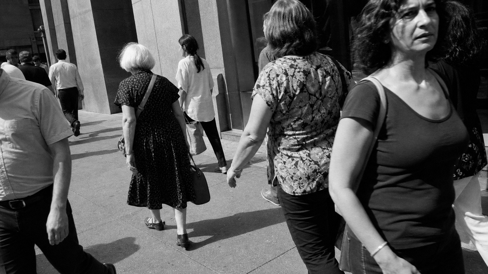

# Garry Winogrand

[中文](README.md)

> **Category:** Photographer  
> **Domain:** Photography  
> **Path:** `style-packages/photographers/garry-winogrand`

## Overview

This package extracts close 35mm observation, proximity to public life, active diagonals, overlapping gestures, and moments that have not been tidied into a pose. It helps an image feel encountered rather than staged.

It does not prescribe a city, crowd, landmark, or public transit. The user chooses the new subject; the package controls the act of looking, crop, tonal structure, film surface, and sense of timing.

## Curatorial note

The force of Winogrand’s approach often sits in a moment that is almost, but not quite, legible: bodies overlap, an action enters from the edge, and the horizon need not behave. The street is not a backdrop; the viewer is returned to the flow of people. The representative image keeps that proximity and instability without making New York or a particular crowd a requirement.

## Subject independence

Your subject, people, objects, place, and narrative remain authoritative. This package controls photographic medium, viewing distance, framing, tone, film grain, and gesture. The sidewalk and pedestrians in the representative image are examples only and are not added to new generations.

## Read before use

- `identity.yaml`: scope and exclusions
- `visual-signature.yaml`: traits that survive a subject change
- `reproduction.yaml`: medium, materials, and build order
- `prompts/base.txt`, `prompts/negative.txt`: prompt constraints
- `palette/palette.json`: tonal roles
- `evaluation.yaml`: post-generation checks
- `references/manifest.csv`, `provenance.yaml`: sources and rights boundaries

## Sources and rights

Exhibition and collection pages are used to study observable traits. External photographs and their images remain the property of their rights holders; this package does not bundle external works or copy a specific photograph’s composition, people, or place. The representative image is a new anonymous scene and does not imply collaboration, authorization, or endorsement.

Source: [The Metropolitan Museum of Art exhibition on Garry Winogrand](https://www.metmuseum.org/exhibitions/listings/2014/garry-winogrand). See [`provenance.yaml`](provenance.yaml), [`references/manifest.csv`](references/manifest.csv), and the repository [`NOTICE`](../../../NOTICE).

## Use only this package

### Method 1: Give the package to an image-capable Agent

Upload this directory or provide its local path. Ask the Agent to read the identity, visual signature, reproduction, prompt, tonal, and evaluation files first, then compile your subject into a complete prompt. Tell it to use only the package’s photographic rules, avoid fixed cities, crowds, and landmarks, and review the result against `evaluation.yaml`.

### Method 2: Copy the prompts

Open `prompts/base.txt`, replace the subject, location, and aspect ratio, and send `prompts/negative.txt` as the negative prompt. Use the signature and tonal palette for tighter control.

### Method 3: Submit through your own API tool

Configure an API key in your own image platform or compiler, then submit the base prompt, negative constraints, tonal palette, and required reference list. This repository does not host a generation service or manage keys.

### Method 4: Local model + ComfyUI

Connect the prompts to a local model or ComfyUI workflow. Use the reproduction notes to set crop, tone, film grain, and gesture, then review the output with `evaluation.yaml`.

Users manage model weights, keys, and generated images. References are for understanding traits, not for copying source photographs.
