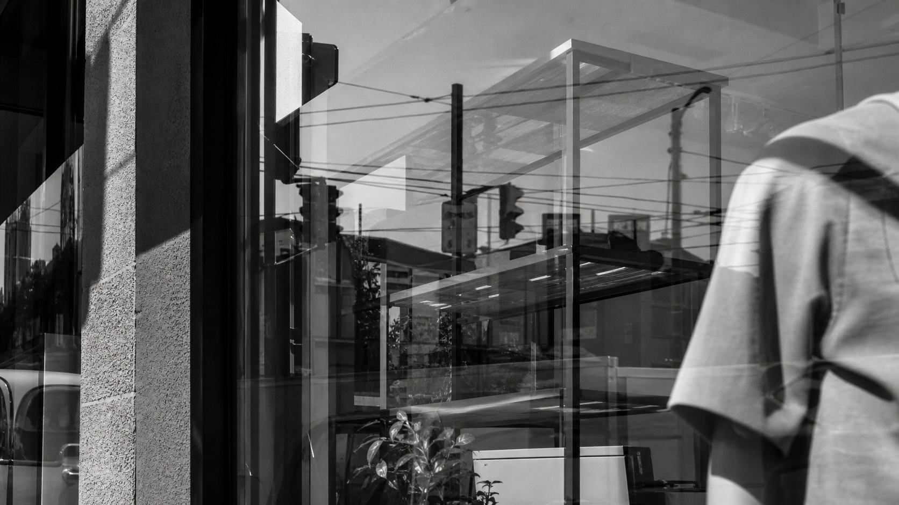

# 李·弗里德兰德

[English](README.en.md)

> **分类：** 摄影师  
> **媒介领域：** 摄影  
> **目录：** `style-packages/photographers/lee-friedlander`

## 简介

李·弗里德兰德的街头摄影常把反射、窗框、线缆、影子和被裁切的身影放进同一张照片。画面信息很多，却不是为了堆热闹，而是让观看在前景和背景之间不断重新定位。本包提取这种多层观察方式，不把城市、商店、汽车或行人写成固定主体。

## 策展短评

它有一种很特别的“不把画面整理得太乖”的诚实。遮挡不是缺陷，反射也不是装饰，它们让照片保留了现场观看的摩擦感。使用时要控制层次数量，复杂应该来自真实空间，而不是后期拼贴。

## 主体独立性

本包只决定观察和摄影处理，不规定城市、人物、建筑、车辆或事件。代表图只是展示反射、遮挡和黑白密度的测试场景，用户主体始终优先。

## 来源与版权

研究入口为[现代艺术博物馆的艺术家档案](https://www.moma.org/artists/2002-lee-friedlander)。仓库不打包外部作品；代表图是新的匿名场景，不是具体原作，也不表示合作、授权或背书关系。

## 只使用此包

### 方式一：交给有生图能力的 Agent

把本目录交给 Agent，让它先读取 `identity.yaml`、`visual-signature.yaml`、`reproduction.yaml`、`prompts/`、`palette/palette.json` 和 `evaluation.yaml`，再将你的主体和场景编译成完整 Prompt。只有在场景支持时才添加反射或遮挡层。

### 方式二：直接复制 Prompt

打开 `prompts/base.txt`，替换 `{{SUBJECT}}`、`{{ASPECT_RATIO}}` 和 `{{USE_CASE}}`；把 `prompts/negative.txt` 一并提交给支持负面 Prompt 的平台。

### 方式三：配置 API Key 后提交生成

在你自己的生图平台或编译工具中配置 API Key，提交基础 Prompt、负面约束和调色板。本仓库不托管密钥或在线生图服务。

### 方式四：本地模型 + ComfyUI

将 Prompt、调色板和复现说明接入本地模型或 ComfyUI，生成后用 `evaluation.yaml` 检查反射、遮挡、主体保留和 AI 痕迹。
