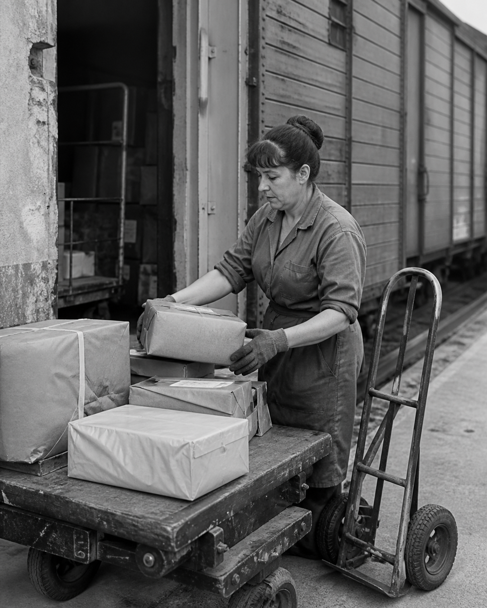

# Lewis Hine




> **分类 / Category:** [摄影师 / Photographers]
> **类型 / Type:** 摄影师 / photographer
> **包路径 / Package path:** `style-packages/photographers/lewis-hine`

## 简介（中文）

这是一个面向「Lewis Hine」的独立 摄影师。它把公开作品、研究资料和可观察视觉特征整理成可执行约束，重点关注 `camera, composition, lighting, palette, surface, subject_treatment`，用于生成新场景，而不是复制某一幅原作。

核心观察点：place a person in a legible work or institutional environment；use machinery, walls, luggage, tools, or architecture to establish scale and social context；allow direct frontal or three-quarter observation without fashion posing；use clear geometry and enough detail for evidence, not atmospheric mystery

## Overview (English)

This is an independent photographer package for “Lewis Hine”. It turns public references, research material, and observable visual decisions into executable constraints focused on `camera, composition, lighting, palette, surface, subject_treatment`. It is intended for new scenes, not copies of a named artwork.

Key observations: place a person in a legible work or institutional environment; use machinery, walls, luggage, tools, or architecture to establish scale and social context; allow direct frontal or three-quarter observation without fashion posing; use clear geometry and enough detail for evidence, not atmospheric mystery

## 来源与版权（中文）

参考资料只用于研究和风格拆解。外部作品的版权、商标、截图和平台页面仍归原权利人所有；本包不代表与相关艺术家、摄影师、游戏或机构存在合作关系。生成示例是新的匿名场景，不是原作者作品。

来源链接：

- [https://commons.wikimedia.org/wiki/File:Lewis_Hine_Power_house_mechanic_working_on_steam_pump.jpg](https://commons.wikimedia.org/wiki/File:Lewis_Hine_Power_house_mechanic_working_on_steam_pump.jpg)
- [https://www.loc.gov/item/ncl2004001462/PP/](https://www.loc.gov/item/ncl2004001462/PP/)

具体权利边界请先阅读 [`provenance.yaml`](provenance.yaml) 和仓库根目录的 [`NOTICE`](../../../NOTICE)。

## Sources and rights (English)

References are used for research and visual analysis. Copyright, trademarks, screenshots, and source pages remain with their respective rights holders. This package is independent and does not imply endorsement or affiliation. Generated examples are anonymous new scenes, not works by the referenced creator.

Source links:

- [https://commons.wikimedia.org/wiki/File:Lewis_Hine_Power_house_mechanic_working_on_steam_pump.jpg](https://commons.wikimedia.org/wiki/File:Lewis_Hine_Power_house_mechanic_working_on_steam_pump.jpg)
- [https://www.loc.gov/item/ncl2004001462/PP/](https://www.loc.gov/item/ncl2004001462/PP/)

Read [`provenance.yaml`](provenance.yaml) when present and the repository [`NOTICE`](../../../NOTICE) before redistributing anything.

## 只使用此包 / Use only this package

### 方式一：下载风格包，复制生成 Prompt

下载本目录，打开 `style-packages/photographers/lewis-hine/prompts/base.txt`，替换变量后复制。 把包内变量替换为你的主题，再将生成的 Prompt 复制到任意支持文字生图的平台。参考图、负面约束和可选参数见同目录文件。

Download this directory. Open `style-packages/photographers/lewis-hine/prompts/base.txt`, fill in its variables, and paste the result. Fill in the variables and paste the resulting Prompt into an image model. Reference roles, negative constraints, and optional parameters are kept beside the package.

### 方式二：配置 API Key，一键生成

OhMyStyle 不托管用户密钥。配置你选择的模型提供商 API Key 后，编译器只生成 provider-neutral 任务；再由你选择的 API 适配器提交，仓库不保存密钥。

```bash
python tools/compile-style.py style-packages/photographers/lewis-hine --subject "你的主题" --profile weak --output tmp/lewis-hine-job.json
```

The compiler emits a provider-neutral job; your chosen API adapter submits it. The repository never stores your key. Keep API keys outside the repository and let your chosen adapter submit the job to the model.

### 方式三：本地模型 + ComfyUI 工作流

将 `prompts/`、`references/`、`palette/` 和生成的 job 导入本地模型工作流；模型权重由用户自行安装。 像素、遮罩或构图约束优先使用包内的 reproduction 与 workflow 文件。

Import `prompts/`, `references/`, `palette/`, and the compiled job into a local workflow; users install their own model weights. Use the package reproduction and workflow files when available. Model weights are not bundled; ComfyUI runs the models installed by the user.

## 包内文件 / Package files

- [package.yaml](package.yaml)
- [provenance.yaml](provenance.yaml)
- [reference manifest](references/manifest.csv)
- See the package visual signature and reproduction files for the complete constraint set.

## 免责声明 / Disclaimer

风格包描述的是可观察的媒介、构图、色彩、光线和表面决策，不保证任何模型得到完全相同的输出，也不鼓励复制受保护作品的具体构图、人物、文字或标志。

The package describes observable decisions in medium, composition, color, light, and surface. It does not guarantee identical output and does not authorize copying protected compositions, characters, text, or marks.
