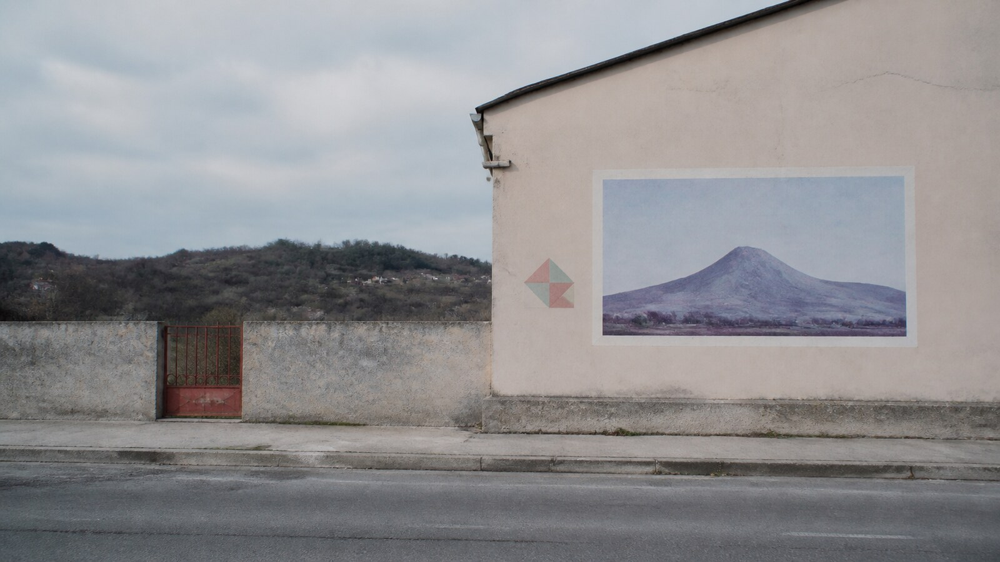

# 路易吉·吉里

[English](README.en.md)

> **分类：** 摄影师　**媒介：** 克制的彩色摄影　**目录：** `style-packages/photographers/luigi-ghirri`

## 简介

路易吉·吉里擅长把普通景物拍得像一个关于图像本身的疑问：墙面、模型、标识、道路和远景之间的尺度关系被轻轻错开，颜色则保持安静、柔和而有秩序。这个包提取的是观察距离、彩色层次和现实与再现之间的张力，不是某个旅行地点。

## 策展短评

我喜欢它的克制。画面不急着证明自己“很有氛围”，而是让一块褪色墙面、一条水平线或一个不合比例的形状慢慢改变观看方式。生成时，先把题材说清楚，再让摄影语言保持安静，通常比堆叠怀旧词更接近这个方向。

## 主体独立性

本包只决定观察距离、构图、自然光、色彩和颗粒。地图、模型、海岸、意大利建筑和旅游地标都不是默认主体。

## 文件导航

- `identity.yaml`：来源、范围和主体边界
- `visual-signature.yaml`：观察距离、构图、色彩和光线
- `reproduction.yaml`：拍摄与调色顺序
- `prompts/`：基础 Prompt 与负面约束
- `palette/palette.json`：色彩角色
- `evaluation.yaml`：主体独立性与视觉签名检查
- `references/manifest.csv`、`provenance.yaml`：参考来源和权利边界

## 来源与版权

本包参考[现代艺术博物馆的路易吉·吉里资料](https://www.moma.org/artists/39882-luigi-ghirri)以及[路易吉·吉里基金会的艺术家简介](https://fondazioneluigighirri.it/en/artist/biography)。原摄影作品归原权利人所有；代表图是新的匿名场景，不是具体照片的复制品，也不代表艺术家或机构的授权、合作或背书。

## 只使用此包

### 方式一：交给有生图能力的 Agent

把本目录交给 Agent，要求它先读取身份、视觉签名、复现说明、Prompt、调色板和评价文件，再把你的主体、地点、画幅和用途编译成最终任务。生成后检查它是否保持了安静的观察距离，而不是自动加入地图、模型或地标。

### 方式二：直接复制 Prompt

复制 `prompts/base.txt`，替换 `{SUBJECT}` 和 `{LOCATION}`；同时提交 `prompts/negative.txt`。想保留更稳定的色彩关系时，再参考 `visual-signature.yaml` 和调色板。

### 方式三：配置 API Key 后提交生成

在你自己的生图平台或编译工具中配置 API Key，把基础 Prompt、负面约束和调色板一起提交。本仓库不托管密钥或在线生图服务。

### 方式四：本地模型 + ComfyUI

把基础 Prompt 和负面约束接入本地模型或 ComfyUI，按复现说明设置自然光、普通观察距离、低对比中间调和细颗粒，生成后用 `evaluation.yaml` 复核。

模型权重、API Key 和生成图片由使用者自行管理。参考图只用于理解视觉特征，不要复制原作构图、人物、文字、商标或标志。
