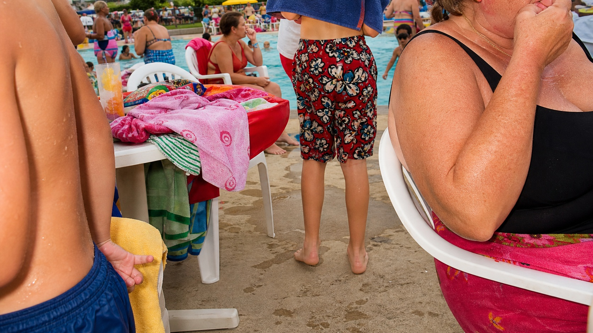

# Martin Parr

[中文说明](README.md)

> **Category:** Photographer  
> **Medium:** Contemporary color documentary photography  
> **Directory:** `style-packages/photographers/martin-parr`

## Overview

Martin Parr often brings the camera close, using direct flash, vivid color, cropped bodies, and relationships between ordinary objects to observe social life. The humor usually comes from an action, a posture, and a background detail landing together, not from a staged pose or explanatory text. This package transfers that everyday observational method without making pools, beaches, tourists, or food default subjects.

## Curatorial note

What I like in Parr's photographs is the moment when life reveals a small flaw by itself. No grand event is needed: a plastic chair, a wet towel, a cropped body, and direct light can form a precise social slice. Protect privacy and let awkwardness come from the composition rather than turning a person into a joke; the image then keeps both insight and warmth.

## Subject independence

This package controls viewing distance, direct light, color saturation, cropping, and relationships between everyday details. It does not prescribe a person, pool, beach, resort, food, or event. The public pool in the representative image is only a benchmark subject.

## Sources and rights

Research entries are Martin Parr's [official introduction](https://martinparr.com/introduction/) and [curriculum vitae](https://martinparr.com/cv/). The repository does not bundle external photographs. The representative image is newly generated and anonymous, not a reproduction of a specific photograph and not an endorsement or collaboration.

## Use this package only

### Method 1: Give it to an image-capable Agent

Give this directory to an Agent. Ask it to read `identity.yaml`, `visual-signature.yaml`, `reproduction.yaml`, `prompts/`, `palette/palette.json`, and `evaluation.yaml`, then compile your subject, aspect ratio, and purpose. Review viewing distance, anonymity, on-location color, and cropping after generation.

### Method 2: Copy the Prompt directly

Open `prompts/base.txt`, replace `{{SUBJECT}}`, `{{ASPECT_RATIO}}`, and `{{USE_CASE}}`, and submit `prompts/negative.txt` as well on platforms that support negative prompts.

### Method 3: Configure an API key and submit

Configure an API key in your own image service or compiler, then submit the base prompt, negative constraints, and palette. This repository does not host keys or an online image service.

### Method 4: Local model + ComfyUI

Connect the prompts, palette, and reproduction notes to a local model or ComfyUI workflow. Use `evaluation.yaml` for review; do not treat the pool in the representative image as a default subject.
