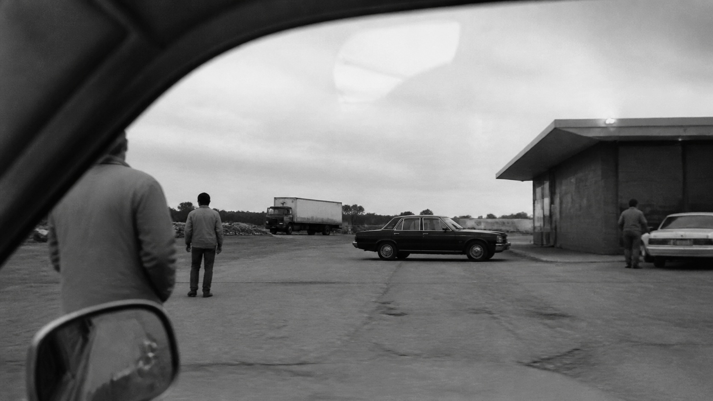

# Robert Frank

[中文版](README.md)

> **Category:** photographer
> **Domain:** photography
> **Path:** `style-packages/photographers/robert-frank`

## Overview

This package treats documentary photography as an open act of looking rather than
a polished answer. Cropping, oblique framing, reflections, uneven exposure, and
ordinary surroundings form a fragment from a larger sequence. It does not make a
road trip, flag, car, or country the default subject.

## Curatorial note

The useful restraint is the refusal to complete the scene. A corner, reflection,
or cropped figure can let the viewer infer the situation. Ordinary places often
work better than spectacular scenery; the frame should retain some accident
without being cleaned into advertising.

## Subject independence

This package controls the way the subject is observed, not the people, place,
objects, or event. The roadside service area is only a benchmark environment.

## Sources and rights

The Metropolitan Museum of Art exhibition material is used as a research source.
External photographs, portraits, trademarks, and web content remain with their
rights holders. This repository stores a source link and an original anonymous
demonstration only.

## Use only this package

1. Give the directory to an image-capable Agent and ask it to read the package
   rules before compiling your own subject and scene.
2. Copy `prompts/base.txt`, replace the subject, location, and aspect ratio, and
   use `prompts/negative.txt` when supported.
3. Submit the prompt, tonal palette, and constraints through your own API tool;
   the repository does not host generation.
4. Connect it to a local model or ComfyUI workflow and review the result against
   `evaluation.yaml`.
