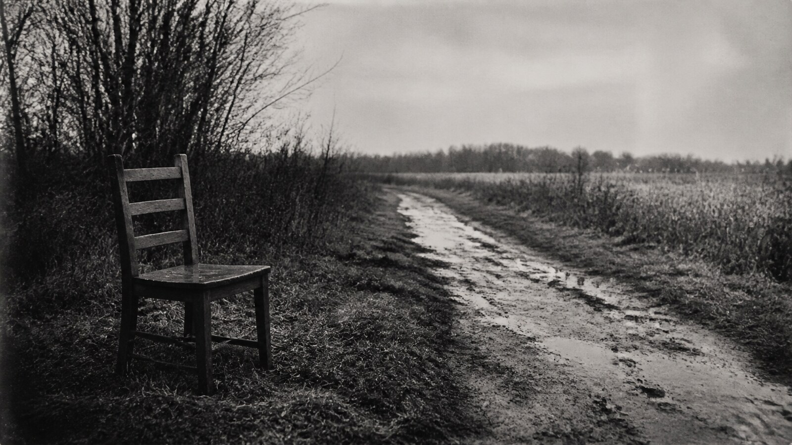

# 萨莉·曼

[English](README.en.md)

> **分类：** 摄影师  
> **媒介领域：** 摄影  
> **目录：** `style-packages/photographers/sally-mann`

## 简介

这个包把大画幅黑白摄影的缓慢观看、深而开放的灰阶、自然光和潮湿纸面组织成一套可迁移的视觉规则。人物、地点和故事不由包决定。

## 策展短评

它的力量不在于把画面做旧，而在于让时间停留在灰阶的缝隙里。亮部要有空气，暗部要有重量，主体周围还要留一点不急于解释的空间。换成椅子、建筑或一段普通地面，仍然应该能感到同样的观看距离。

## 主体独立性

本包只决定视觉处理，不决定主体。示例中的人物、家庭、南方乡野和湿版摄影语境都不是默认要求。

## 来源与版权

本包参考 [旧金山现代艺术博物馆艺术家页面](https://www.sfmoma.org/artist/Sally_Mann/) 与 [美国国家美术馆作品页面](https://www.nga.gov/artists/39122-sally-mann/artworks) 提取可观察特征。外部作品仍归原权利人所有；仓库只保留链接，不打包原作，不主张合作、授权或背书。

## 只使用此包

1. **交给有生图能力的 Agent：** 上传本目录，请 Agent 读取规则文件，先编译你的主体，再生成并按 `evaluation.yaml` 复核。
2. **复制 Prompt：** 用 `prompts/base.txt`，替换主体、地点、画幅和用途，并提交 `prompts/negative.txt`。
3. **使用自己的 API：** 配置你自己的 API Key，提交 Prompt、负面约束、调色板和参考链接；密钥由你保管。
4. **本地模型与 ComfyUI：** 接入 Prompt，按复现说明控制灰阶、纸面和光线，生成后用评价文件检查。

参考图只用于理解可观察特征，不复制原作的构图、人物、文字、商标或标志。
