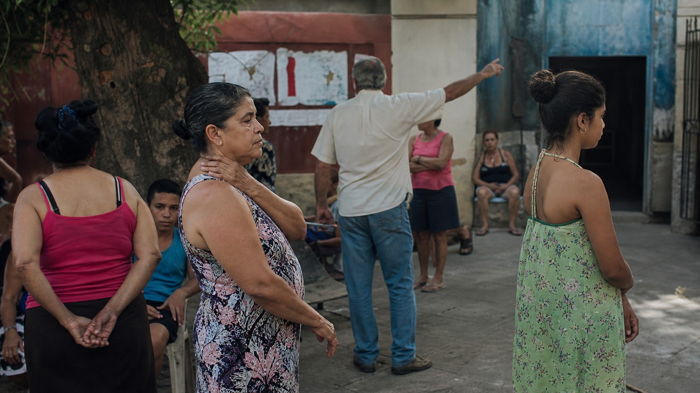

# 苏珊·梅塞拉斯

[English](README.en.md)

> **分类：** 摄影师  
> **媒介领域：** 摄影  
> **目录：** `style-packages/photographers/susan-meiselas`

## 简介

这个包提取长期纪实的耐心、人物与环境的并置、现场关系、自然色彩和人尺度的观看距离。它让画面保留“事情还在继续”的感觉，同时不把主题变成新闻事件或固定的社会场景。

它不规定战争、嘉年华、抗议、国家或社区。新的主体由使用者决定，包只负责观察方式、语境、影调和摄影表面。

## 策展短评

梅塞拉斯的作品让我想到，纪实摄影的力量不只来自一个强烈瞬间，也来自愿意在现场多停留一会儿。人物的手势、墙面、道路和彼此的距离共同构成信息。代表图选择了日常聚集，是为了展示这种关系感；真正需要迁移的是对语境的尊重，而不是某个国家或事件。

## 主体独立性

你的主题、人物、物体、地点和叙事优先。本包只负责纪实媒介、观察距离、环境语境、自然色彩和胶片质感。代表图中的庭院与聚集者只是示例，不会自动出现在新的生成结果里。

## 使用前先看

- `identity.yaml`：范围与排除项
- `visual-signature.yaml`：换主体后仍应保留的视觉特征
- `reproduction.yaml`：媒介、材料和构建顺序
- `prompts/base.txt`、`prompts/negative.txt`：基础约束
- `palette/palette.json`：色彩角色
- `evaluation.yaml`：生成后的检查标准
- `references/manifest.csv`、`provenance.yaml`：来源与权利边界

## 来源与版权

摄影师资料和机构页面只用于研究可观察特征。外部摄影作品及其图像权利仍归原权利人所有；本包不捆绑外部作品，也不复制某张照片的构图、人物或事件。代表图是新的匿名场景，不代表与摄影师或机构存在合作、授权或背书关系。

来源： [马格南图片社的苏珊·梅塞拉斯资料](https://www.magnumphotos.com/photographer/susan-meiselas/)。详细边界见 [`provenance.yaml`](provenance.yaml)、[`references/manifest.csv`](references/manifest.csv) 和仓库根目录的 [`NOTICE`](../../../NOTICE)。

## 只使用此包

### 方式一：交给有生图能力的 Agent

把本目录上传给 Agent，或提供本地路径，并告诉它：先读取身份、视觉签名、复现说明、Prompt、调色板和评估文件，再把你的主题编译成完整 Prompt。要求它只使用包中的纪实和语境规则，不强行加入战争、嘉年华或抗议，并在生成后按 `evaluation.yaml` 检查。

### 方式二：直接复制 Prompt

打开 `prompts/base.txt`，替换主题、地点和画幅；把 `prompts/negative.txt` 一并作为负面约束。需要更稳定时，同时参考视觉签名和调色板。

### 方式三：配置 API Key 后提交生成

在你自己的生图平台或编译工具中配置 API Key，再提交基础 Prompt、负面约束、调色板和必要的参考清单。本仓库不托管密钥，也不提供在线生图服务。

### 方式四：本地模型 + ComfyUI

把基础 Prompt 和负面约束接入本地模型或 ComfyUI 工作流，按复现说明设置人物关系、环境语境、自然色彩和摄影表面，生成后用 `evaluation.yaml` 复核。

模型权重、密钥和生成图片由使用者自行管理。参考资料用于理解特征，不用于复制原作。
