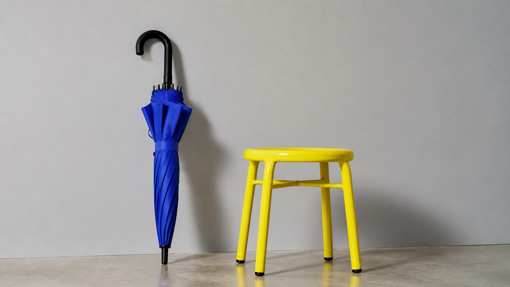
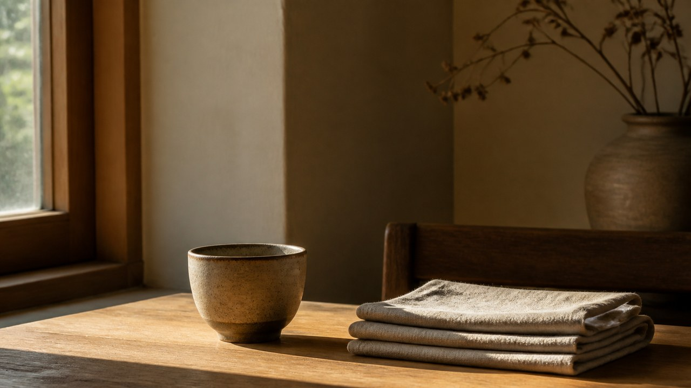
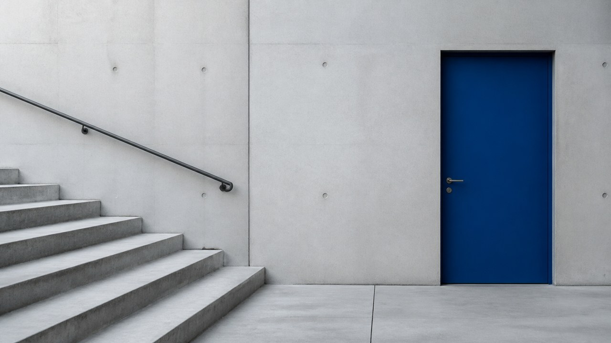
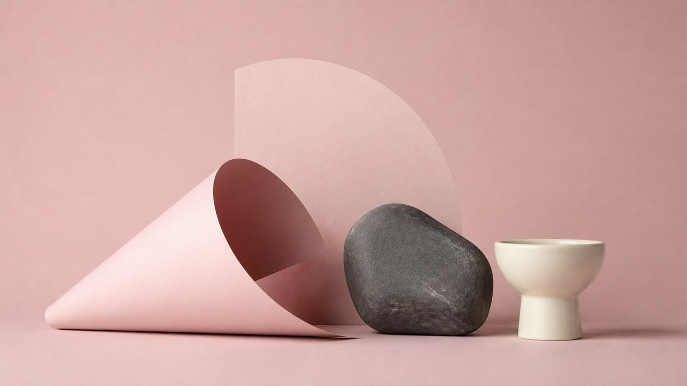
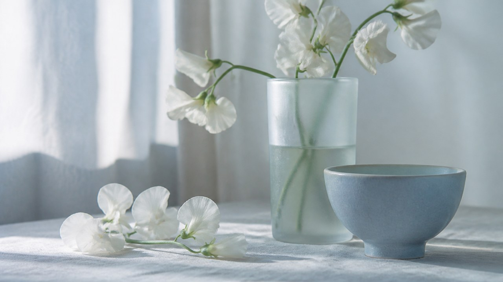
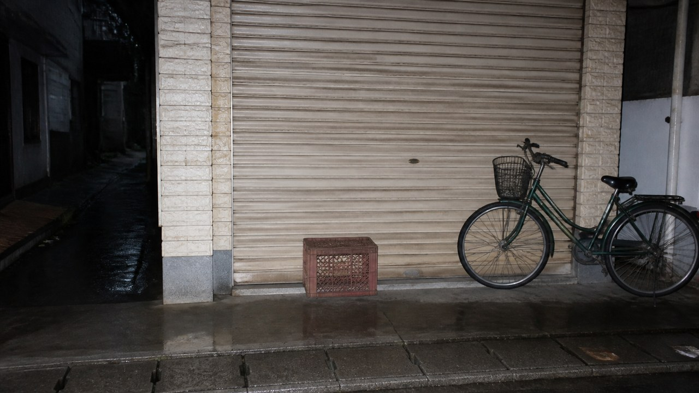

# 原创预设

[English](README.en.md)

本目录收录 17 个独立风格包。每个卡片使用统一的横版 16:9 代表图，点击图片或名称进入风格包 README。

<table>
<tr>
<td width="33%" valign="top" align="center"> <strong>酸黄钴蓝</strong> <a href="./acid-yellow-cobalt/README.md">打开 README</a></td>
<td width="33%" valign="top" align="center"> <strong>琥珀窗光室内</strong> <a href="./amber-window-interior/README.md">打开 README</a></td>
<td width="33%" valign="top" align="center"> <strong>冷灰混凝土极简</strong> <a href="./cool-concrete-minimal/README.md">打开 README</a></td>
</tr>
<tr>
<td width="33%" valign="top" align="center"> <strong>深影剧场光</strong> <a href="./deep-shadow-theater/README.md">打开 README</a></td>
<td width="33%" valign="top" align="center"> <strong>灰粉影棚静物</strong> <a href="./dusty-rose-studio/README.md">打开 README</a></td>
<td width="33%" valign="top" align="center"> <strong>森林绿自然主义</strong> <a href="./forest-green-naturalism/README.md">打开 README</a></td>
</tr>
<tr>
<td width="33%" valign="top" align="center"> <strong>磨砂日光</strong> <a href="./frosted-daylight/README.md">打开 README</a></td>
<td width="33%" valign="top" align="center"> <strong>硬光色块摄影</strong> <a href="./hard-light-color-blocking/README.md">打开 README</a></td>
<td width="33%" valign="top" align="center"> <strong>高纯度撞色</strong> <a href="./high-chroma-color-pairing/README.md">打开 README</a></td>
</tr>
<tr>
<td width="33%" valign="top" align="center"> <strong>银盐黑白纪实</strong> <a href="./monochrome-silver-gelatin/README.md">打开 README</a></td>
<td width="33%" valign="top" align="center"> <strong>低饱和纪实色彩</strong> <a href="./muted-documentary-color/README.md">打开 README</a></td>
<td width="33%" valign="top" align="center"> <strong>自然窗光</strong> <a href="./natural-window-light/README.md">打开 README</a></td>
</tr>
<tr>
<td width="33%" valign="top" align="center"> <strong>夜色蓝调</strong> <a href="./nocturnal-blue-hour/README.md">打开 README</a></td>
<td width="33%" valign="top" align="center"> <strong>粉彩胶片人像</strong> <a href="./pastel-film-portrait/README.md">打开 README</a></td>
<td width="33%" valign="top" align="center"> <strong>安静直闪纪实</strong> <a href="./quiet-flash-documentary/README.md">打开 README</a></td>
</tr>
<tr>
<td width="33%" valign="top" align="center"> <strong>柔和阴天编辑摄影</strong> <a href="./soft-overcast-editorial/README.md">打开 README</a></td>
<td width="33%" valign="top" align="center"> <strong>暖纸色静物</strong> <a href="./warm-paper-still-life/README.md">打开 README</a></td>
<td width="33%"></td>
</tr>
</table>
