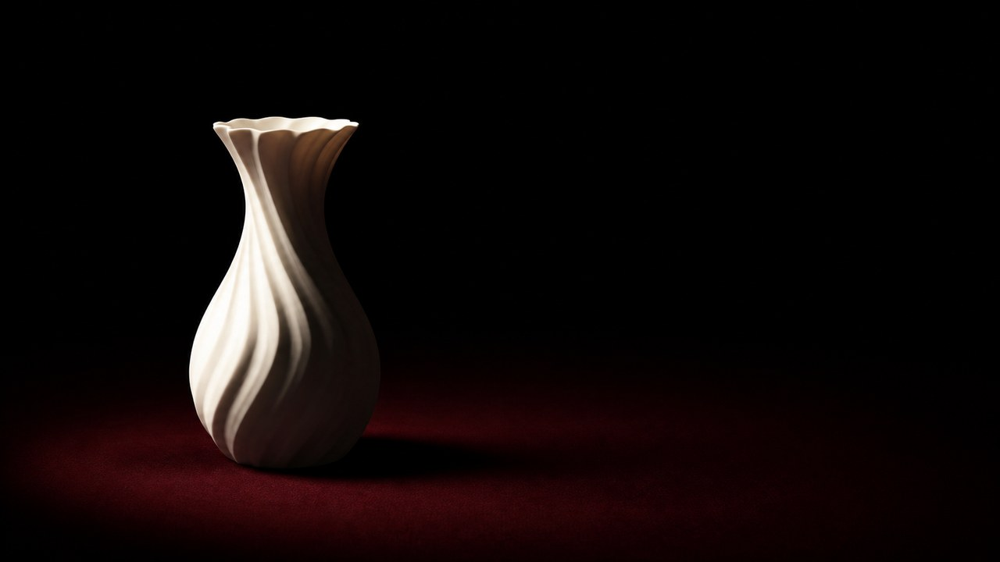

# 深影剧场光

[English](README.en.md)



> **分类：** 摄影
> **目录：** `style-packages/presets/deep-shadow-theater`

## 简介

以单一控制光源、深色负空间和雕塑化轮廓建立克制的剧场式光线预设。

## 可观察特征

single controlled spotlight, deep negative space, sculptural silhouette, restrained theatrical light。本包把媒介、构图、光线、色彩、材质和表面处理写成可执行规则，支持把同一组规则迁移到新的主题、物体和场景。

## 参考来源

- [OhMyStyle 项目说明](https://github.com/ZhouYinLong-lab/OhMyStyle)
- [本包的原创整理声明](https://github.com/ZhouYinLong-lab/OhMyStyle)

## 来源与版权

本包为 OhMyStyle 独立整理的原创预设，不指向某位艺术家、摄影师、学校或具体作品。

参考页面只用于研究与归因，外部作品、摄影作品、校名、校徽、商标和页面内容仍归原权利人所有。仓库中的生成示例是新的匿名场景，不代表学校、机构或作者的授权、合作或背书。

## 只使用此包

四种方式可以任选一种，不需要同时使用。

### 方式一：交给有生图能力的 Agent

把整个风格包目录上传给具备生图能力的 Agent，或把本地目录路径交给它，并附上：

```text
请使用这个风格包帮助我生成图片。

请先读取本目录中的：
- identity.yaml
- visual-signature.yaml
- reproduction.yaml
- prompts/base.txt
- prompts/negative.txt
- palette/palette.json
- evaluation.yaml

请把这些文件中的规则整合到生成流程中，不要只把风格名称当作 Prompt，也不要复制参考作品、校徽、商标或现成构图。

我的生成需求是：
<填写人物、物体、场景、画幅和用途>

请先把我的需求编译成完整 Prompt，再调用你的生图能力生成图片。生成后，请按照 evaluation.yaml 检查风格特征、构图、颜色、材质、AI 痕迹和 Prompt 遵循度；如果发现明显问题，请说明问题并进行一次针对性修正。
```

### 方式二：直接复制 Prompt

打开 `prompts/base.txt`，将主题、人物、物体、场景、画幅和用途替换为自己的需求；把 `prompts/negative.txt` 中的限制作为负面 Prompt 一并提交到支持文本生图的平台。需要更稳定时，同时参考 `visual-signature.yaml` 和 `palette/palette.json`。

### 方式三：配置 API Key 后提交生成

在你使用的生图平台或自己的编译工具中配置 API Key，将本包的基础 Prompt、负面约束、调色板和必要的参考图一起提交。API Key 只保存在你自己的环境中；本仓库不代管密钥、不托管在线生图服务，也不承诺某个平台的免费额度或接口兼容性。

### 方式四：本地模型 + ComfyUI

将 `prompts/base.txt` 和 `prompts/negative.txt` 接入本地模型或 ComfyUI 工作流；按 `palette/palette.json` 调整颜色，按 `references/manifest.csv` 选择参考图，并用 `reproduction.yaml` 约束构图、材质和光线。生成后可用 `evaluation.yaml` 做人工或自动复核。

参考图只用于理解可观察特征，不要复制原作的具体构图、人物、文字、商标、校徽或标志。模型权重、API Key 和生成图片由使用者自行管理。
