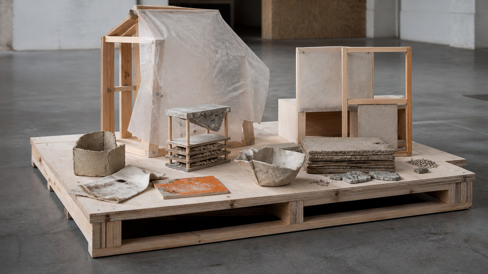

# 埃因霍温设计学院

[English](README.en.md)

> **分类：** 设计学校  
> **媒介领域：** 设计  
> **目录：** `style-packages/schools/design-academy-eindhoven`

## 简介

这个包提取材料实验、批判性问题意识、社会语境和原型逻辑，把生成结果引向“可讨论的设计研究”，而不是普通产品广告或漂亮的未来概念图。

## 策展短评

好的设计研究不会急着把试验痕迹藏起来。材料的粗糙、连接方式和使用后果都应该在画面里留下位置。使用这个包时，主体可以是一件日用品、一个空间或一个抽象问题，关键是让它看起来像在提出问题，而不是在展示标准答案。

## 主体独立性

本包只决定视觉处理，不决定产品类型、展厅、家具或环保符号。示例中的原型只是说明材料研究方式。

## 来源与版权

本包参考 [学校官方愿景与使命](https://www.designacademy.nl/page/6083/vision-mission) 与 [官方毕业展介绍](https://www.designacademy.nl/page/5937/graduation-show) 提取可观察特征。学生项目和学校图像仍归原权利人所有；仓库不复制具体作品、标志或展陈布局。

## 只使用此包

1. **交给有生图能力的 Agent：** 上传本目录，请 Agent 先读取规则并确认你的设计主体，再生成和复核。
2. **复制 Prompt：** 用 `prompts/base.txt` 替换主体、地点、画幅和用途，把负面约束一并提交。
3. **使用自己的 API：** 配置自己的 API Key，提交 Prompt、负面约束、调色板和参考链接。
4. **本地模型与 ComfyUI：** 接入 Prompt，按复现说明控制材料、结构、光线与细节，生成后检查。

参考图只用于理解可观察特征，不复制学生项目的构图、物件、文字、商标或标志。
