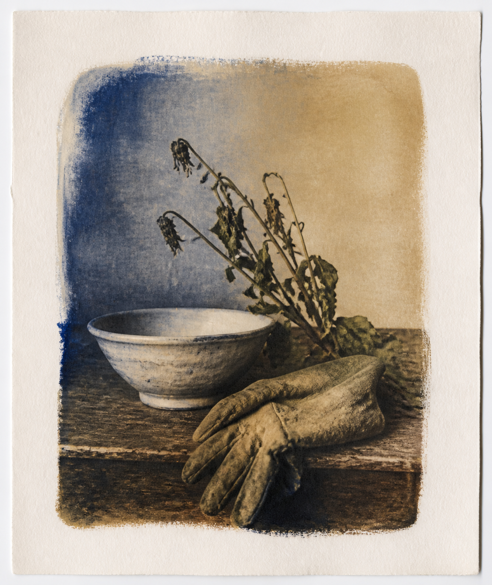

# 工艺与媒介 / Techniques and media

本目录收录 1 个独立风格包。每个小单元都有代表图、名称和双语 README；点击 README 可查看来源、版权边界和三种使用方式。

This directory contains 1 independent style packages. Each package has a representative image, a bilingual README, provenance notes, and three usage modes.

<table>
<tr>
<td width="33%" valign="top" align="center">
 
<strong>Gum Bichromate Printing</strong> 
<a href="gum-bichromate/README.md">打开 README / Open README</a>
</td>
<td width="33%"></td>
<td width="33%"></td>
</tr>
</table>
