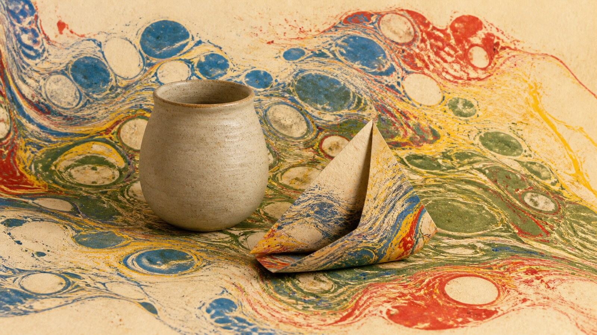

# Ebru Paper Marbling

[中文版](README.md)

> **Category:** Technique and medium　**Medium:** Floating pigment and paper transfer　**Directory:** `style-packages/techniques/ebru-paper-marbling`

## Overview

This package turns the process of floating pigment on a viscous bath and transferring it to paper into portable visual rules. Drops, spreading, drawing, combing, and paper absorption create cloud forms, stone patterns, and flowing bands. The chance comes from the material process, not from digital noise.

## Curatorial note

What I like is that the process is controlled without becoming obedient. Give the bath a direction, allow the pigment to drift at the edges, and let paper capture the surface; the uncertainty feels tactile and is more distinctive than simply adding “gradient” or “dreamy.”

## Subject independence

This package controls fluid patterns, pigment boundaries, transfer, paper absorption, and texture. Books, flowers, calligraphy, Turkish ornament, and decorated pages are not defaults.

## File guide

- `identity.yaml`: source, scope, and subject boundaries
- `visual-signature.yaml`: fluid behavior, composition, color, and paper
- `reproduction.yaml`: construction order from bath to paper
- `prompts/`: base prompt and negative constraints
- `palette/palette.json`: color roles
- `evaluation.yaml`: subject-independence and signature checks
- `references/manifest.csv`, `provenance.yaml`: source and rights boundaries

## Sources and rights

The package studies floating pigment, combing, and transfer through [The Metropolitan Museum of Art’s marbled-paper essay](https://www.metmuseum.org/ja/perspectives/marbled-paper) and the [British Museum’s marbled-paper object record](https://www.britishmuseum.org/collection/object/W_1991-0620-0-3). Collection works remain with their rights holders. The representative image is a new anonymous scene, not a copied sheet or endorsement.

## Use only this package

### Method 1: Give it to an image-capable Agent

Give the Agent this directory and ask it to read the identity, visual signature, reproduction notes, prompts, palette, and evaluation file before compiling your subject, location, aspect ratio, and intended use. The sample ceramic vessel demonstrates transfer; it is not a default subject.

### Method 2: Copy the Prompt

Copy `prompts/base.txt`, replace `{SUBJECT}` and `{LOCATION}`, and submit `prompts/negative.txt` as the negative prompt. Use the palette and reproduction notes for tighter hue and process control.

### Method 3: Configure an API key and submit

Configure your API key in your own image platform or compiler, then submit the base prompt, negative constraints, and palette. This repository does not host keys or an online image service.

### Method 4: Local model + ComfyUI

Connect the base and negative prompts to a local model or ComfyUI workflow. Follow the reproduction notes for fluid boundaries, combing direction, paper absorption, and transfer variation, then review with `evaluation.yaml`.

Model weights, API keys, and generated images remain under the user’s control. Use references to understand visual characteristics; do not copy a source sheet, text, trademark, or logo.
