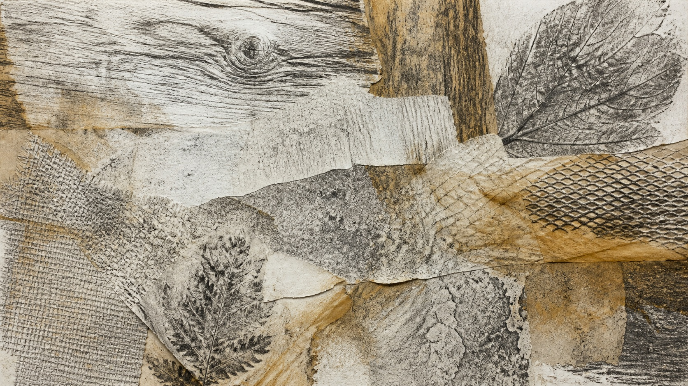

# 擦拓画法

[English](README.en.md)

> **分类：** 工艺与视觉技法  
> **媒介领域：** 纸面转印、拼贴与混合媒介  
> **目录：** style-packages/techniques/frottage

## 简介

擦拓画法不是在画面上统一加一层颗粒。它依靠纸张与不同纹理表面的接触，通过压力、方向、纸张厚度和叠层顺序把材料痕迹转移到纸面。纹理既有偶然性，也可以沿着主体结构被安排。

## 策展短评

这个包的魅力在于它让“材料”变成了构图的一部分。木纹、织物或网格不需要成为画面里的物体，它们只是留下触感的工具。使用时，主体可以保持简单，真正的变化发生在边缘、空白和不同压力留下的断裂里。

## 主体独立性

本包只决定擦拓、纸纤维、粉末、压痕和材料叠层，不规定人物、物体、地点或故事。代表图中的纹理样本只是测试材料方法。

## 来源与版权

研究入口为[现代美术馆的擦拓技法介绍](https://www.modernamuseet.se/en/stockholm/exhibitions/max-ernst/collage-frottage-grattage/)。仓库不打包外部作品；代表图是新的匿名材料研究，不是具体原作，也不表示合作、授权或背书关系。

## 只使用此包

### 方式一：交给有生图能力的 Agent

把整个风格包目录交给 Agent，先读取 identity.yaml、visual-signature.yaml、reproduction.yaml、prompts、palette/palette.json 和 evaluation.yaml，再把你的主体、画幅和用途编译进生成任务。

### 方式二：直接复制 Prompt

复制 prompts/base.txt，替换主体和画幅；把 prompts/negative.txt 一并提交。

### 方式三：配置 API Key 后提交生成

在你自己的生图平台或编译工具中配置 API Key，提交基础 Prompt、负面约束和调色板。本仓库不托管密钥或在线生图服务。

### 方式四：本地模型 + ComfyUI

将 Prompt、调色板和复现说明接入本地模型或 ComfyUI，生成后用 evaluation.yaml 检查压力变化、材料区分、纸面层次和固定题材泄漏。
