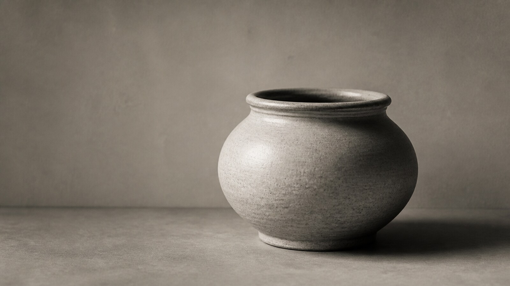

# 铂钯印相

[English](README.en.md)

> **分类：** 工艺与媒介  
> **媒介领域：** 摄影  
> **目录：** `style-packages/techniques/platinum-palladium-printing`

## 简介

这个包模拟铂钯印相的观看经验：图像像被吸收到哑光纤维纸里，灰阶连续，阴影深却不堵，高光柔和，整体带有克制的暖中性色。它描述的是成像工艺，不规定你必须拍人像或风景。

## 策展短评

铂钯印相的美不靠复古边框或棕色滤镜，而在于画面和纸面之间没有明显的隔层。主体可以很现代，重要的是让光线、纸张和灰阶一起工作。看似安静的表面，其实保留了曝光、涂布和材料吸收的细微变化。

## 主体独立性

本包只决定成像表面、灰阶和印相质感，不决定人物、建筑、器物、地点或时代。

## 来源与版权

本包参考 [美国国家美术馆工艺说明](https://www.nga.gov/stories/videos/platinum-and-palladium-photography-making-print)、[盖蒂铂金摄影专题](https://www.getty.edu/art/exhibitions/focus_platinum/index.html) 与 [美国国家美术馆工艺研究](https://www.nga.gov/research/publications/alfred-stieglitz-key-set/stieglitzs-practices-processes) 提取可观察特征。外部作品仍归原权利人所有；仓库只保留链接，不复制具体照片。

## 只使用此包

1. **交给有生图能力的 Agent：** 上传本目录，请 Agent 读取工艺规则，先确认你的摄影主体，再生成并复核。
2. **复制 Prompt：** 用 `prompts/base.txt` 替换主体、地点、画幅和用途，把负面约束一并提交。
3. **使用自己的 API：** 配置自己的 API Key，提交 Prompt、负面约束、调色板和参考链接。
4. **本地模型与 ComfyUI：** 接入 Prompt，按复现说明控制灰阶、纸面和光线，生成后检查。

参考图只用于理解可观察特征，不复制原作的构图、人物、文字、商标或标志。
