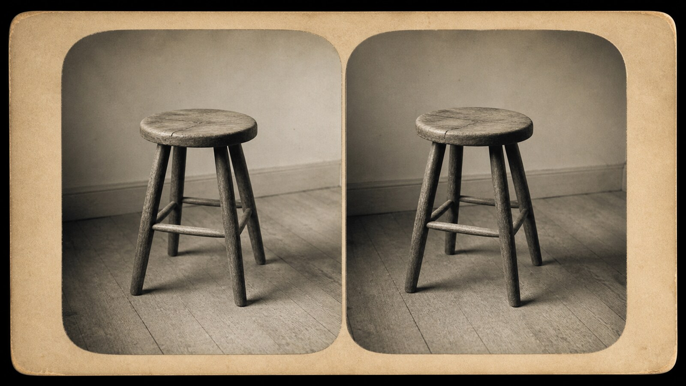

# 立体摄影

[English](README.en.md)

> **分类：** 工艺与视觉技法  · **媒介领域：** 摄影格式与观看技术
> **目录：** style-packages/techniques/stereoscopic-photography

## 简介

以左右视点略有差异的双联影像、卡片式编排和可感知的空间错位模拟早期立体摄影观看经验。

## 一点观察

立体摄影的核心不是“复古滤镜”，而是两个略有差异的视点被并置后产生空间错觉。这个包控制双联格式、视差和观看逻辑，不自动加入旅游景点、历史人物或特定年代故事。

## 视觉签名

- 左右双联视图与明确的卡片式编排
- 轻微水平视差带来的空间错觉
- 银盐照片或手工着色的有限色调
- 两张图之间保持可比较但不完全相同的细节

## 主体独立性

本包只决定视觉处理方式，不决定用户要生成的人物、物体、地点、数量或故事。代表图和测试题材只是演示，不会成为默认内容；不会自动加入固定地标、角色、建筑、道具、宗教场景、游戏关卡或叙事事件。

## 来源与版权

参考资料只用于研究和分析。外部作品、摄影作品、游戏画面、商标和平台页面仍归原权利人所有。生成示例是新的匿名场景，不是相关艺术家、摄影师、技法、学院或游戏的原作，也不代表合作、授权或背书关系。

- [立体摄影与摄影工艺资料](https://www.vam.ac.uk/info/collection-selection-boxes-photography-processes-and-techniques)

详细来源和再分发边界见 [provenance.yaml](provenance.yaml)、[references/manifest.csv](references/manifest.csv) 以及仓库根目录的 [NOTICE](../../../NOTICE)。

## 只使用此包

四种方式可以按手边工具任选其一，不需要同时使用。

### 方式一：交给有生图能力的 Agent

把整个风格包目录上传给 Agent，或把本地目录路径交给它，并附上：

~~~
请使用这个风格包帮助我生成图片。
请先读取 identity.yaml、visual-signature.yaml、reproduction.yaml、prompts/base.txt、
prompts/negative.txt、palette/palette.json 和 evaluation.yaml。
请把文件中的规则整合到生成流程中，不要只把风格名称当作 Prompt，也不要复制参考作品。
我的生成需求是：<填写人物、物体、场景、画幅和用途>
请先编译完整 Prompt，再调用你的生图能力。生成后按照 evaluation.yaml 检查风格特征、
构图、颜色、材质、AI 痕迹和需求遵循度，并说明仍然存在的风险。
~~~

### 方式二：直接复制 Prompt

打开 [prompts/base.txt](prompts/base.txt)，替换主题、人物、物体、场景和画幅；将 [prompts/negative.txt](prompts/negative.txt) 作为负面 Prompt 一并提交到支持文本生图的平台。

### 方式三：配置 API Key 后提交生成

在你自己的生图平台或编译工具中配置 API Key，将基础 Prompt、负面约束、调色板和必要的参考清单一起提交。本仓库不代管密钥、不托管在线生图服务。

### 方式四：本地模型 + ComfyUI

将基础 Prompt 和负面约束接入本地模型或 ComfyUI 工作流；按调色板、复现说明和参考清单设置颜色、构图、材质与光线。生成后用 [evaluation.yaml](evaluation.yaml) 做复核。

模型权重、API Key 和生成图片由使用者自行管理。参考图只用于理解可观察特征，不要复制原作的具体构图、人物、文字、商标或标志。
