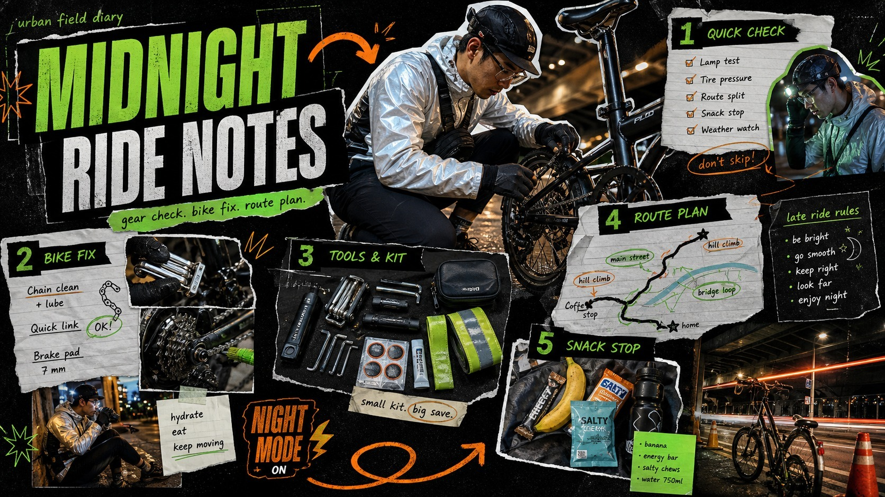

# Neon Outdoor Diary Longform Collage Style

[English](README.en.md)



## 简介

以炭黑画布、纪实动作照片剪影、酸绿动势标题、撕纸面板、手绘箭头、贴纸标签、编号区块和密集社交笔记组成移动端长幅日记海报。

这是继承自 `AI-Visual-Prompt-Cookbook` 的兼容预设。本仓库保留原始归属、文件结构和许可证边界。

## 只使用此预设

四种方式可以按手边的工具任选其一，不需要同时使用。

### 方式一：交给有生图能力的 Agent

把整个预设目录上传给具备生图能力的 Agent，或把本地目录路径交给它，并附上下面的任务说明：

```
请使用这个继承预设帮助我生成图片。

请先读取本目录中的：
- style.json
- README.md
- preview-16x9.jpg

请从 style.json 中提取 Prompt、变量和约束，不要只把预设名称当作 Prompt，也不要复制预览图的具体构图、人物、文字、商标或标志。

我的生成需求是：
<填写人物、物体、场景、画幅和用途>

请先把我的需求与预设规则编译成完整 Prompt，再调用你的生图能力生成图片。生成后，请检查预设特征、构图、颜色、材质、AI 痕迹和 Prompt 遵循度；如果发现明显问题，请说明问题并进行一次针对性修正。
```

### 方式二：直接复制 Prompt

打开 `style.json`，或打开 [可复制的 Prompt](../../docs/copy-prompts/neon-outdoor-diary-longform-collage-style.md)，替换其中的主题和变量后，提交到支持文字生图的平台。需要更稳定时，同时参考本目录的预览图和约束字段。

### 方式三：配置 API Key 后提交生成

在你使用的生图平台或自己的编译工具中配置 API Key，将 `style.json` 中的 Prompt、变量、负面约束和必要的预览参考图一起提交。API Key 只保存在你自己的环境中；本仓库不代管密钥、不托管在线生成服务，也不承诺某个平台的免费额度或接口兼容性。

### 方式四：本地模型 + ComfyUI

将 `style.json` 中的 Prompt 和约束字段接入本地模型或 ComfyUI 工作流；把预览图作为理解特征的参考，并按 JSON 中的变量和构图要求调整工作流。生成后进行人工复核，避免直接复制预览图。

预览图只用于理解可观察特征，不要复制原项目预览图的具体构图、人物、文字、商标或标志。继承内容的原始归属和许可证边界仍然有效，请同时阅读仓库的 NOTICE 与 LICENSE。

## 来源与版权

本预设的原始描述和预览图保留原项目归属。请阅读仓库的 NOTICE 和 LICENSE，不要把继承内容重新声明为原创。

详细来源和再分发边界见仓库的 [`NOTICE`](../../NOTICE) 与 [`LICENSE`](../../LICENSE)。
